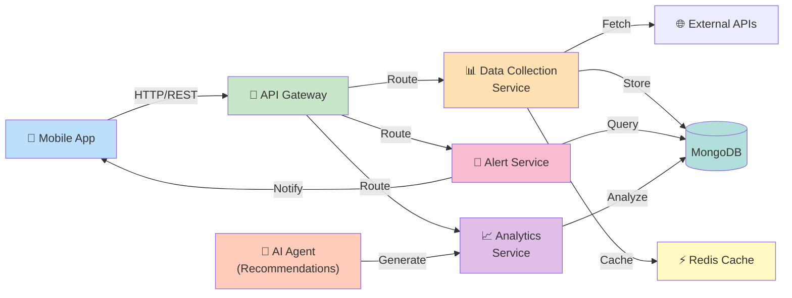
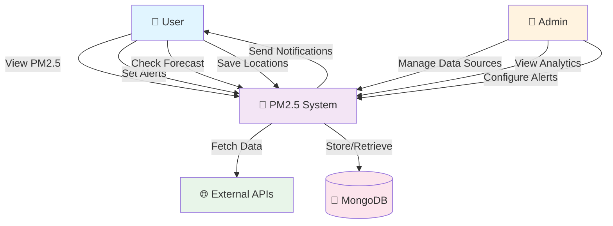

จาก Nepkin 
Mobile App PM2.5 Monitoring System

1. ขอบเขตของระบบงาน
• Real-time PM2.5 Data Collection
Fetch from government air quality APIs
Location-based monitoring (GPS integration)
Historical data storage and retrieval

• User Features
View current PM2.5 levels by location
Health alerts and recommendations
Favorite locations tracking
Air quality forecasting

• Admin Features
Data source management
User analytics dashboard
System monitoring and maintenance

2. รายละเอียดของงาน ข้อมูลที่ได้มา
• Data Sources
Government air quality APIs (Thai PCD, AirVisual)
Weather data integration
Health guideline databases

• Data Processing
Real-time PM2.5 index calculation
Trend analysis and forecasting
Alert generation based on thresholds

• Storage Requirements
User profiles and preferences
Historical PM2.5 readings
Location coordinates and metadata

3. เครื่องมือที่ใช้ประกอบ
• Backend Architecture
Python (FastAPI/Flask for APIs)
Microservices: Data Collection Service, Alert Service, Analytics Service
NoSQL Database: MongoDB (flexible schema for sensor data)

• External Integrations
Air Quality APIs (PCD, AirVisual, OpenWeatherMap)
AI Agent: Recommendation engine for health suggestions

• Mobile Frontend
React Native / Flutter
Real-time data visualization (charts, maps)

# System Architecture (Mermaid)

Use Case Diagram (Mermaid)

# ***********************************************
```mermaid

```

ถาม Grok ว่า
ช่วยคิดโครงงาน Mobile App เกี่ยวฝุ่นละออง PM2.5 ประกอบด้วย
1.ขอบเขตของระบบงาน ประกอบด้วยอะไร
2.รายละเอียดของงาน ข้อมูลที่ได้มา
3.เครื่องมือที่ใช้ประกอบ ภาษา python , API , Database NoSQL
4.ช่วยร่าง  use case diagram ให้ด้วย แบบ merraid

ผลลัพธ์ที่ได้
1. ขอบเขตของระบบงาน (Scope of the System)
โครงงานนี้เป็นแอพพลิเคชันมือถือ (Mobile App) ที่มุ่งเน้นการตรวจสอบและแจ้งเตือนเกี่ยวกับฝุ่นละออง PM2.5 เพื่อช่วยให้ผู้ใช้งานสามารถติดตามคุณภาพอากาศในพื้นที่ของตนเองและพื้นที่ใกล้เคียงได้แบบเรียลไทม์ โดยขอบเขตของระบบงานประกอบด้วยส่วนหลักดังนี้:
ฟังก์ชันหลักสำหรับผู้ใช้งานทั่วไป:
แสดงข้อมูลระดับ PM2.5 แบบเรียลไทม์และพยากรณ์ (forecast) ในรูปแบบแผนที่ (map view) หรือรายการสถานที่ (list view).
แจ้งเตือน (notification) เมื่อระดับ PM2.5 สูงเกินค่ามาตรฐาน (เช่น เกิน 50 µg/m³ ตามมาตรฐาน AQI).
แสดงคำแนะนำสุขภาพตามระดับ PM2.5 (เช่น สวมหน้ากากอนามัย หรือหลีกเลี่ยงกิจกรรมกลางแจ้ง).
บันทึกประวัติข้อมูลส่วนบุคคล เช่น สถานที่โปรดหรือการแจ้งเตือนที่ได้รับ.
ฟังก์ชันสำหรับผู้ดูแลระบบ (Admin):
จัดการข้อมูลผู้ใช้งานและการแจ้งเตือน (เช่น ตั้งค่า threshold สำหรับแจ้งเตือน).
ตรวจสอบ logs การใช้งานและข้อมูลจาก API.
ขอบเขตที่ไม่รวม:
ไม่รวมการติดตั้งเซ็นเซอร์ฮาร์ดแวร์จริง (ใช้ข้อมูลจาก API สาธารณะเท่านั้น).
ไม่รวมการวิเคราะห์ข้อมูลเชิงลึกทางวิทยาศาสตร์ (เช่น สาเหตุของฝุ่น) แต่เน้นการแสดงผลและแจ้งเตือน.
รองรับเฉพาะระบบปฏิบัติการ Android/iOS ไม่รวมเว็บแอพหรือเดสก์ท็อป.
ข้อมูลครอบคลุมเฉพาะประเทศไทยและพื้นที่ใกล้เคียง (เช่น ภาคเหนือที่มักมีปัญหาฝุ่น PM2.5).
ระบบจะเน้นความเรียบง่าย ใช้งานง่าย และประหยัดทรัพยากร โดยมุ่งเป้าไปที่ผู้ใช้งานในพื้นที่เสี่ยงอย่าง Phitsanulok ซึ่งมักได้รับผลกระทบจากฝุ่นควัน.
2. รายละเอียดของงานและข้อมูลที่ได้มา (Details of the Work and Data Sources)
รายละเอียดของงานแบ่งเป็นขั้นตอนหลักดังนี้:
การรวบรวมข้อมูล (Data Collection):
ดึงข้อมูล PM2.5 แบบเรียลไทม์จาก API สาธารณะ เช่น:
AirVisual API (จาก IQAir): ให้ข้อมูล AQI, PM2.5, และพยากรณ์ในเมืองต่างๆ ทั่วโลก รวมถึงประเทศไทย.
OpenWeatherMap API: สำหรับข้อมูลอากาศและมลพิษ (มีแผนฟรีสำหรับนักพัฒนา).
API จากหน่วยงานรัฐบาลไทย เช่น จากกรมควบคุมมลพิษ (Pollution Control Department) หรือ GISTDA (หน่วยงานด้านภูมิสารสนเทศ) ที่ให้ข้อมูล PM2.5 จากสถานีตรวจวัดทั่วประเทศ.
ข้อมูลเพิ่มเติม: สภาพอากาศ (อุณหภูมิ ความชื้น ลม) ที่อาจส่งผลต่อระดับ PM2.5 จาก API เดียวกัน.
การประมวลผลข้อมูล (Data Processing):
ใช้ Python ใน backend เพื่อวิเคราะห์ข้อมูล เช่น คำนวณค่าเฉลี่ยรายวัน/รายสัปดาห์, ตรวจสอบ threshold สำหรับแจ้งเตือน, และแปลงข้อมูลเป็นรูปแบบ JSON สำหรับส่งไปยังแอพมือถือ.
จัดเก็บข้อมูลชั่วคราวหรือประวัติในฐานข้อมูล NoSQL เพื่อความยืดหยุ่น (เช่น เก็บ logs การแจ้งเตือนของผู้ใช้).
การแสดงผลและ互动 (User Interaction):
แอพมือถือแสดงข้อมูลในรูปแบบกราฟ (chart), แผนที่ (ใช้ Google Maps API หรือ Leaflet), และแจ้งเตือน push notification (ใช้ Firebase Cloud Messaging).
ผู้ใช้สามารถตั้งค่าตำแหน่ง (location-based) เพื่อรับข้อมูลเฉพาะพื้นที่ เช่น Phitsanulok.
การทดสอบและปรับปรุง (Testing and Iteration):
ทดสอบใน simulator และอุปกรณ์จริงเพื่อความแม่นยำของข้อมูลและการแจ้งเตือน.
รวบรวม feedback จากผู้ใช้เพื่อปรับปรุง เช่น เพิ่มฟีเจอร์รายงานฝุ่นจากผู้ใช้ (crowdsourcing).
ข้อมูลที่ได้มาจะอัปเดตแบบเรียลไทม์ทุก 5-15 นาที ขึ้นอยู่กับ API และจะมี fallback หาก API ล้มเหลว (เช่น แสดงข้อมูลล่าสุดที่เก็บไว้).
3. เครื่องมือที่ใช้ประกอบ (Tools and Technologies)
ตามที่ระบุ ระบบจะใช้ Python เป็นภาษาหลักสำหรับ backend, API สำหรับดึงข้อมูล, และ NoSQL Database สำหรับเก็บข้อมูล โดยรายละเอียดดังนี้:
ภาษา Python:
ใช้สำหรับ backend server (เช่น ด้วย Flask หรือ FastAPI) เพื่อประมวลผลข้อมูลจาก API, สร้าง logic สำหรับแจ้งเตือน, และเชื่อมต่อกับฐานข้อมูล.
Library ที่เกี่ยวข้อง: Requests สำหรับเรียก API, Pandas สำหรับวิเคราะห์ข้อมูล, Matplotlib หรือ Seaborn สำหรับสร้างกราฟ (ถ้าต้องการ export เป็นภาพสำหรับแอพ).
API:
API สำหรับข้อมูล PM2.5: AirVisual API, OpenWeatherMap API, หรือ API จากกรมควบคุมมลพิษไทย (ถ้ามี public endpoint).
API เพิ่มเติม: Google Maps API สำหรับแผนที่, Firebase API สำหรับ push notification และ authentication ผู้ใช้.
Database NoSQL:
ใช้ MongoDB หรือ Firebase Firestore เพื่อเก็บข้อมูลที่ไม่เป็นโครงสร้างชัดเจน เช่น ประวัติการแจ้งเตือน, ข้อมูลผู้ใช้ (user preferences), และ logs ข้อมูล PM2.5 ชั่วคราว.
เหตุผล: NoSQL เหมาะกับข้อมูลที่เปลี่ยนแปลงบ่อยและไม่ต้องการ schema แข็งตัว เช่น JSON จาก API.
เครื่องมืออื่นๆ ที่เกี่ยวข้อง (เพื่อความสมบูรณ์):
Frontend: Flutter หรือ React Native สำหรับพัฒนาแอพมือถือ cross-platform.
Deployment: Heroku หรือ AWS สำหรับ host backend Python.
Version Control: GitHub สำหรับจัดการโค้ด.
4. ร่าง Use Case Diagram ในรูปแบบ Mermaid
ด้านล่างนี้คือร่าง Use Case Diagram แบบง่าย โดยใช้ Mermaid syntax. Diagram นี้แสดง Actors หลัก (User และ Admin) และ Use Cases ที่เกี่ยวข้องกับระบบ.

```mermaid

graph TD
    subgraph "Mobile App for PM2.5 Monitoring"
        A[User] --> UC1[View PM2.5 Levels]
        A --> UC2[Receive Alerts]
        A --> UC3[Set Preferences]
        A --> UC4[View Health Tips]
        
        B[Admin] --> UC5[Manage Users]
        B --> UC6[Update Thresholds]
        B --> UC7[View Logs]
        
        UC1 --> S[System]
        UC2 --> S
        UC3 --> S
        UC4 --> S
        UC5 --> S
        UC6 --> S
        UC7 --> S
    end
    S[Backend System] --> API[External APIs]
    S --> DB[NoSQL Database]
```
