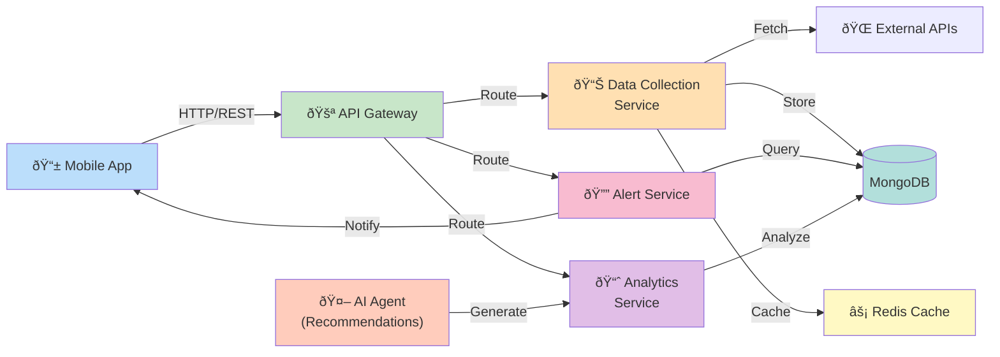
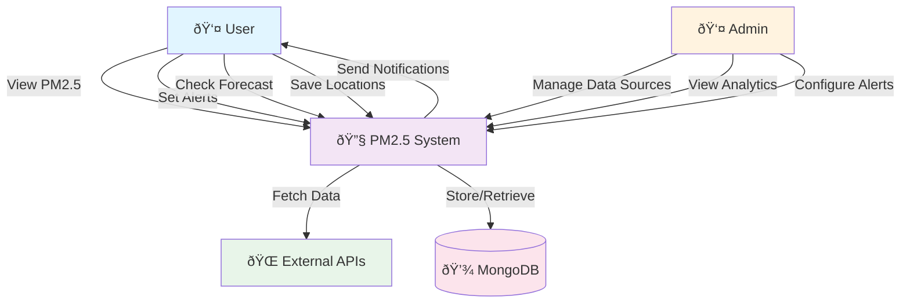

จาภNepkin 
Mobile App PM2.5 Monitoring System

1. ขอบเขตของระบบงาน
• Real-time PM2.5 Data Collection
Fetch from government air quality APIs
Location-based monitoring (GPS integration)
Historical data storage and retrieval

• User Features
View current PM2.5 levels by location
Health alerts and recommendations
Favorite locations tracking
Air quality forecasting

• Admin Features
Data source management
User analytics dashboard
System monitoring and maintenance

2. รายละเอียดของงาน ข้อมูลที่ได้มา
• Data Sources
Government air quality APIs (Thai PCD, AirVisual)
Weather data integration
Health guideline databases

• Data Processing
Real-time PM2.5 index calculation
Trend analysis and forecasting
Alert generation based on thresholds

• Storage Requirements
User profiles and preferences
Historical PM2.5 readings
Location coordinates and metadata

3. เครื่องมือที่ใช้ประà¸à¸­à¸š
• Backend Architecture
Python (FastAPI/Flask for APIs)
Microservices: Data Collection Service, Alert Service, Analytics Service
NoSQL Database: MongoDB (flexible schema for sensor data)

• External Integrations
Air Quality APIs (PCD, AirVisual, OpenWeatherMap)
AI Agent: Recommendation engine for health suggestions

• Mobile Frontend
React Native / Flutter
Real-time data visualization (charts, maps)

# System Architecture (Mermaid)

Use Case Diagram (Mermaid)

# ***********************************************
```mermaid

```

ถาม Grok ว่า
ช่วยคิดโครงงาน Mobile App เà¸à¸µà¹ˆà¸¢à¸§à¸à¸¸à¹ˆà¸™à¸¥à¸°à¸­à¸­à¸‡ PM2.5 ประà¸à¸­à¸šà¸”้วย
1.ขอบเขตของระบบงาน ประà¸à¸­à¸šà¸”้วยอะไร
2.รายละเอียดของงาน ข้อมูลที่ได้มา
3.เครื่องมือที่ใช้ประà¸à¸­à¸š ภาษา python , API , Database NoSQL
4.ช่วยร่าง  use case diagram ให้ด้วย à¹à¸šà¸š merraid

ผลลัพธ์ที่ได้
1. ขอบเขตของระบบงาน (Scope of the System)
โครงงานนี้เป็นà¹à¸­à¸žà¸žà¸¥à¸´à¹€à¸„ชันมือถือ (Mobile App) ที่มุ่งเน้นà¸à¸²à¸£à¸•à¸£à¸§à¸ˆà¸ªà¸­à¸šà¹à¸¥à¸°à¹à¸ˆà¹‰à¸‡à¹€à¸•à¸·à¸­à¸™à¹€à¸à¸µà¹ˆà¸¢à¸§à¸à¸±à¸šà¸à¸¸à¹ˆà¸™à¸¥à¸°à¸­à¸­à¸‡ PM2.5 เพื่อช่วยให้ผู้ใช้งานสามารถติดตามคุณภาพอาà¸à¸²à¸¨à¹ƒà¸™à¸žà¸·à¹‰à¸™à¸—ี่ของตนเองà¹à¸¥à¸°à¸žà¸·à¹‰à¸™à¸—ี่ใà¸à¸¥à¹‰à¹€à¸„ียงได้à¹à¸šà¸šà¹€à¸£à¸µà¸¢à¸¥à¹„ทม์ โดยขอบเขตของระบบงานประà¸à¸­à¸šà¸”้วยส่วนหลัà¸à¸”ังนี้:
ฟังà¸à¹Œà¸Šà¸±à¸™à¸«à¸¥à¸±à¸à¸ªà¸³à¸«à¸£à¸±à¸šà¸œà¸¹à¹‰à¹ƒà¸Šà¹‰à¸‡à¸²à¸™à¸—ั่วไป:
à¹à¸ªà¸”งข้อมูลระดับ PM2.5 à¹à¸šà¸šà¹€à¸£à¸µà¸¢à¸¥à¹„ทม์à¹à¸¥à¸°à¸žà¸¢à¸²à¸à¸£à¸“์ (forecast) ในรูปà¹à¸šà¸šà¹à¸œà¸™à¸—ี่ (map view) หรือรายà¸à¸²à¸£à¸ªà¸–านที่ (list view).
à¹à¸ˆà¹‰à¸‡à¹€à¸•à¸·à¸­à¸™ (notification) เมื่อระดับ PM2.5 สูงเà¸à¸´à¸™à¸„่ามาตรà¸à¸²à¸™ (เช่น เà¸à¸´à¸™ 50 µg/m³ ตามมาตรà¸à¸²à¸™ AQI).
à¹à¸ªà¸”งคำà¹à¸™à¸°à¸™à¸³à¸ªà¸¸à¸‚ภาพตามระดับ PM2.5 (เช่น สวมหน้าà¸à¸²à¸à¸­à¸™à¸²à¸¡à¸±à¸¢ หรือหลีà¸à¹€à¸¥à¸µà¹ˆà¸¢à¸‡à¸à¸´à¸ˆà¸à¸£à¸£à¸¡à¸à¸¥à¸²à¸‡à¹à¸ˆà¹‰à¸‡).
บันทึà¸à¸›à¸£à¸°à¸§à¸±à¸•à¸´à¸‚้อมูลส่วนบุคคล เช่น สถานที่โปรดหรือà¸à¸²à¸£à¹à¸ˆà¹‰à¸‡à¹€à¸•à¸·à¸­à¸™à¸—ี่ได้รับ.
ฟังà¸à¹Œà¸Šà¸±à¸™à¸ªà¸³à¸«à¸£à¸±à¸šà¸œà¸¹à¹‰à¸”ูà¹à¸¥à¸£à¸°à¸šà¸š (Admin):
จัดà¸à¸²à¸£à¸‚้อมูลผู้ใช้งานà¹à¸¥à¸°à¸à¸²à¸£à¹à¸ˆà¹‰à¸‡à¹€à¸•à¸·à¸­à¸™ (เช่น ตั้งค่า threshold สำหรับà¹à¸ˆà¹‰à¸‡à¹€à¸•à¸·à¸­à¸™).
ตรวจสอบ logs à¸à¸²à¸£à¹ƒà¸Šà¹‰à¸‡à¸²à¸™à¹à¸¥à¸°à¸‚้อมูลจาภAPI.
ขอบเขตที่ไม่รวม:
ไม่รวมà¸à¸²à¸£à¸•à¸´à¸”ตั้งเซ็นเซอร์ฮาร์ดà¹à¸§à¸£à¹Œà¸ˆà¸£à¸´à¸‡ (ใช้ข้อมูลจาภAPI สาธารณะเท่านั้น).
ไม่รวมà¸à¸²à¸£à¸§à¸´à¹€à¸„ราะห์ข้อมูลเชิงลึà¸à¸—างวิทยาศาสตร์ (เช่น สาเหตุของà¸à¸¸à¹ˆà¸™) à¹à¸•à¹ˆà¹€à¸™à¹‰à¸™à¸à¸²à¸£à¹à¸ªà¸”งผลà¹à¸¥à¸°à¹à¸ˆà¹‰à¸‡à¹€à¸•à¸·à¸­à¸™.
รองรับเฉพาะระบบปà¸à¸´à¸šà¸±à¸•à¸´à¸à¸²à¸£ Android/iOS ไม่รวมเว็บà¹à¸­à¸žà¸«à¸£à¸·à¸­à¹€à¸”สà¸à¹Œà¸—็อป.
ข้อมูลครอบคลุมเฉพาะประเทศไทยà¹à¸¥à¸°à¸žà¸·à¹‰à¸™à¸—ี่ใà¸à¸¥à¹‰à¹€à¸„ียง (เช่น ภาคเหนือที่มัà¸à¸¡à¸µà¸›à¸±à¸à¸«à¸²à¸à¸¸à¹ˆà¸™ PM2.5).
ระบบจะเน้นความเรียบง่าย ใช้งานง่าย à¹à¸¥à¸°à¸›à¸£à¸°à¸«à¸¢à¸±à¸”ทรัพยาà¸à¸£ โดยมุ่งเป้าไปที่ผู้ใช้งานในพื้นที่เสี่ยงอย่าง Phitsanulok ซึ่งมัà¸à¹„ด้รับผลà¸à¸£à¸°à¸—บจาà¸à¸à¸¸à¹ˆà¸™à¸„วัน.
2. รายละเอียดของงานà¹à¸¥à¸°à¸‚้อมูลที่ได้มา (Details of the Work and Data Sources)
รายละเอียดของงานà¹à¸šà¹ˆà¸‡à¹€à¸›à¹‡à¸™à¸‚ั้นตอนหลัà¸à¸”ังนี้:
à¸à¸²à¸£à¸£à¸§à¸šà¸£à¸§à¸¡à¸‚้อมูล (Data Collection):
ดึงข้อมูล PM2.5 à¹à¸šà¸šà¹€à¸£à¸µà¸¢à¸¥à¹„ทม์จาภAPI สาธารณะ เช่น:
AirVisual API (จาภIQAir): ให้ข้อมูล AQI, PM2.5, à¹à¸¥à¸°à¸žà¸¢à¸²à¸à¸£à¸“์ในเมืองต่างๆ ทั่วโลภรวมถึงประเทศไทย.
OpenWeatherMap API: สำหรับข้อมูลอาà¸à¸²à¸¨à¹à¸¥à¸°à¸¡à¸¥à¸žà¸´à¸© (มีà¹à¸œà¸™à¸Ÿà¸£à¸µà¸ªà¸³à¸«à¸£à¸±à¸šà¸™à¸±à¸à¸žà¸±à¸’นา).
API จาà¸à¸«à¸™à¹ˆà¸§à¸¢à¸‡à¸²à¸™à¸£à¸±à¸à¸šà¸²à¸¥à¹„ทย เช่น จาà¸à¸à¸£à¸¡à¸„วบคุมมลพิษ (Pollution Control Department) หรือ GISTDA (หน่วยงานด้านภูมิสารสนเทศ) ที่ให้ข้อมูล PM2.5 จาà¸à¸ªà¸–านีตรวจวัดทั่วประเทศ.
ข้อมูลเพิ่มเติม: สภาพอาà¸à¸²à¸¨ (อุณหภูมิ ความชื้น ลม) ที่อาจส่งผลต่อระดับ PM2.5 จาภAPI เดียวà¸à¸±à¸™.
à¸à¸²à¸£à¸›à¸£à¸°à¸¡à¸§à¸¥à¸œà¸¥à¸‚้อมูล (Data Processing):
ใช้ Python ใน backend เพื่อวิเคราะห์ข้อมูล เช่น คำนวณค่าเฉลี่ยรายวัน/รายสัปดาห์, ตรวจสอบ threshold สำหรับà¹à¸ˆà¹‰à¸‡à¹€à¸•à¸·à¸­à¸™, à¹à¸¥à¸°à¹à¸›à¸¥à¸‡à¸‚้อมูลเป็นรูปà¹à¸šà¸š JSON สำหรับส่งไปยังà¹à¸­à¸žà¸¡à¸·à¸­à¸–ือ.
จัดเà¸à¹‡à¸šà¸‚้อมูลชั่วคราวหรือประวัติในà¸à¸²à¸™à¸‚้อมูล NoSQL เพื่อความยืดหยุ่น (เช่น เà¸à¹‡à¸š logs à¸à¸²à¸£à¹à¸ˆà¹‰à¸‡à¹€à¸•à¸·à¸­à¸™à¸‚องผู้ใช้).
à¸à¸²à¸£à¹à¸ªà¸”งผลà¹à¸¥à¸°äº’动 (User Interaction):
à¹à¸­à¸žà¸¡à¸·à¸­à¸–ือà¹à¸ªà¸”งข้อมูลในรูปà¹à¸šà¸šà¸à¸£à¸²à¸Ÿ (chart), à¹à¸œà¸™à¸—ี่ (ใช้ Google Maps API หรือ Leaflet), à¹à¸¥à¸°à¹à¸ˆà¹‰à¸‡à¹€à¸•à¸·à¸­à¸™ push notification (ใช้ Firebase Cloud Messaging).
ผู้ใช้สามารถตั้งค่าตำà¹à¸«à¸™à¹ˆà¸‡ (location-based) เพื่อรับข้อมูลเฉพาะพื้นที่ เช่น Phitsanulok.
à¸à¸²à¸£à¸—ดสอบà¹à¸¥à¸°à¸›à¸£à¸±à¸šà¸›à¸£à¸¸à¸‡ (Testing and Iteration):
ทดสอบใน simulator à¹à¸¥à¸°à¸­à¸¸à¸›à¸à¸£à¸“์จริงเพื่อความà¹à¸¡à¹ˆà¸™à¸¢à¸³à¸‚องข้อมูลà¹à¸¥à¸°à¸à¸²à¸£à¹à¸ˆà¹‰à¸‡à¹€à¸•à¸·à¸­à¸™.
รวบรวม feedback จาà¸à¸œà¸¹à¹‰à¹ƒà¸Šà¹‰à¹€à¸žà¸·à¹ˆà¸­à¸›à¸£à¸±à¸šà¸›à¸£à¸¸à¸‡ เช่น เพิ่มฟีเจอร์รายงานà¸à¸¸à¹ˆà¸™à¸ˆà¸²à¸à¸œà¸¹à¹‰à¹ƒà¸Šà¹‰ (crowdsourcing).
ข้อมูลที่ได้มาจะอัปเดตà¹à¸šà¸šà¹€à¸£à¸µà¸¢à¸¥à¹„ทม์ทุภ5-15 นาที ขึ้นอยู่à¸à¸±à¸š API à¹à¸¥à¸°à¸ˆà¸°à¸¡à¸µ fallback หาภAPI ล้มเหลว (เช่น à¹à¸ªà¸”งข้อมูลล่าสุดที่เà¸à¹‡à¸šà¹„ว้).
3. เครื่องมือที่ใช้ประà¸à¸­à¸š (Tools and Technologies)
ตามที่ระบุ ระบบจะใช้ Python เป็นภาษาหลัà¸à¸ªà¸³à¸«à¸£à¸±à¸š backend, API สำหรับดึงข้อมูล, à¹à¸¥à¸° NoSQL Database สำหรับเà¸à¹‡à¸šà¸‚้อมูล โดยรายละเอียดดังนี้:
ภาษา Python:
ใช้สำหรับ backend server (เช่น ด้วย Flask หรือ FastAPI) เพื่อประมวลผลข้อมูลจาภAPI, สร้าง logic สำหรับà¹à¸ˆà¹‰à¸‡à¹€à¸•à¸·à¸­à¸™, à¹à¸¥à¸°à¹€à¸Šà¸·à¹ˆà¸­à¸¡à¸•à¹ˆà¸­à¸à¸±à¸šà¸à¸²à¸™à¸‚้อมูล.
Library ที่เà¸à¸µà¹ˆà¸¢à¸§à¸‚้อง: Requests สำหรับเรียภAPI, Pandas สำหรับวิเคราะห์ข้อมูล, Matplotlib หรือ Seaborn สำหรับสร้างà¸à¸£à¸²à¸Ÿ (ถ้าต้องà¸à¸²à¸£ export เป็นภาพสำหรับà¹à¸­à¸ž).
API:
API สำหรับข้อมูล PM2.5: AirVisual API, OpenWeatherMap API, หรือ API จาà¸à¸à¸£à¸¡à¸„วบคุมมลพิษไทย (ถ้ามี public endpoint).
API เพิ่มเติม: Google Maps API สำหรับà¹à¸œà¸™à¸—ี่, Firebase API สำหรับ push notification à¹à¸¥à¸° authentication ผู้ใช้.
Database NoSQL:
ใช้ MongoDB หรือ Firebase Firestore เพื่อเà¸à¹‡à¸šà¸‚้อมูลที่ไม่เป็นโครงสร้างชัดเจน เช่น ประวัติà¸à¸²à¸£à¹à¸ˆà¹‰à¸‡à¹€à¸•à¸·à¸­à¸™, ข้อมูลผู้ใช้ (user preferences), à¹à¸¥à¸° logs ข้อมูล PM2.5 ชั่วคราว.
เหตุผล: NoSQL เหมาะà¸à¸±à¸šà¸‚้อมูลที่เปลี่ยนà¹à¸›à¸¥à¸‡à¸šà¹ˆà¸­à¸¢à¹à¸¥à¸°à¹„ม่ต้องà¸à¸²à¸£ schema à¹à¸‚็งตัว เช่น JSON จาภAPI.
เครื่องมืออื่นๆ ที่เà¸à¸µà¹ˆà¸¢à¸§à¸‚้อง (เพื่อความสมบูรณ์):
Frontend: Flutter หรือ React Native สำหรับพัฒนาà¹à¸­à¸žà¸¡à¸·à¸­à¸–ือ cross-platform.
Deployment: Heroku หรือ AWS สำหรับ host backend Python.
Version Control: GitHub สำหรับจัดà¸à¸²à¸£à¹‚ค้ด.
4. ร่าง Use Case Diagram ในรูปà¹à¸šà¸š Mermaid
ด้านล่างนี้คือร่าง Use Case Diagram à¹à¸šà¸šà¸‡à¹ˆà¸²à¸¢ โดยใช้ Mermaid syntax. Diagram นี้à¹à¸ªà¸”ง Actors หลัภ(User à¹à¸¥à¸° Admin) à¹à¸¥à¸° Use Cases ที่เà¸à¸µà¹ˆà¸¢à¸§à¸‚้องà¸à¸±à¸šà¸£à¸°à¸šà¸š.

```mermaid

graph TD
    subgraph "Mobile App for PM2.5 Monitoring"
        A[User] --> UC1[View PM2.5 Levels]
        A --> UC2[Receive Alerts]
        A --> UC3[Set Preferences]
        A --> UC4[View Health Tips]
        
        B[Admin] --> UC5[Manage Users]
        B --> UC6[Update Thresholds]
        B --> UC7[View Logs]
        
        UC1 --> S[System]
        UC2 --> S
        UC3 --> S
        UC4 --> S
        UC5 --> S
        UC6 --> S
        UC7 --> S
    end
    S[Backend System] --> API[External APIs]
    S --> DB[NoSQL Database]
```
