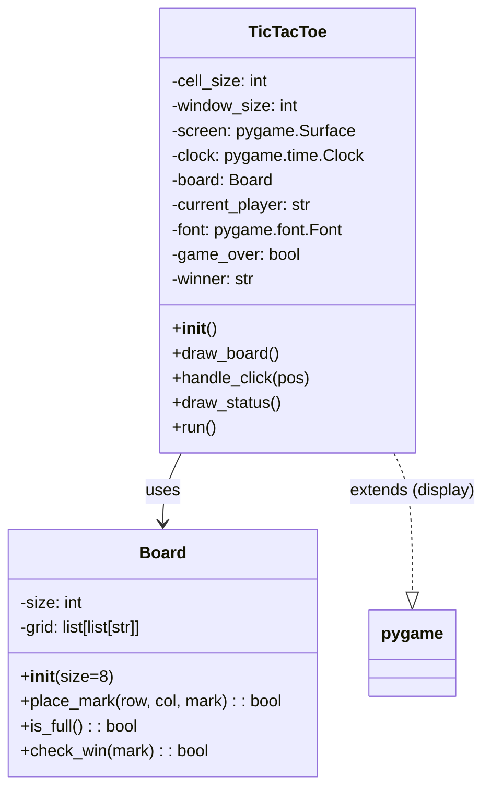
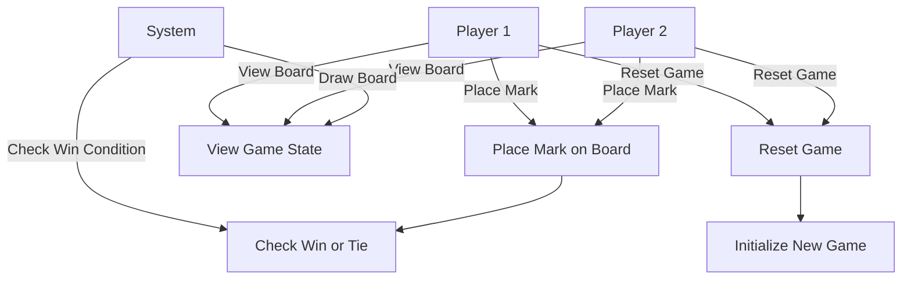
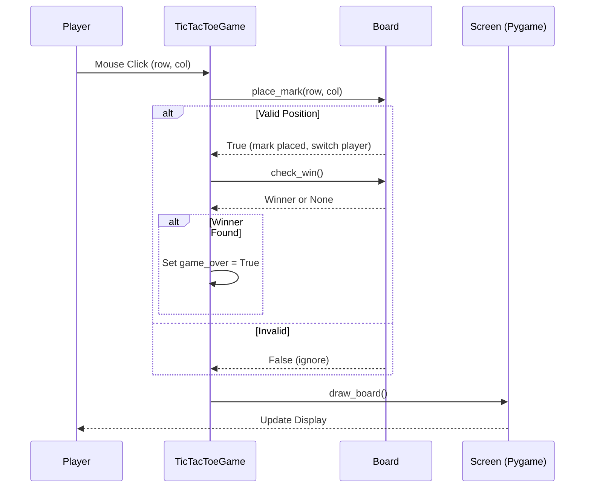

ช่วยเขียน game tic tac toe ด้วยภาษา python และใช้ pygame ในการเขียน
ประกอบด้วย

การเขียนแบบเชิงวัตถุ โดยสร้าง ในรูปแบบตาราง 8x8
จากนั้นช่วยเขียน flowchart การทำงาน ออกมาในรูปแบบ mermaid
และ เขียน use case diagram การทำงาน ออกมาในรูปแบบ mermaid
เขียน sequence Diagram การทำงาน ออกมาในรูปแบบ mermaid
อธิบายการทำงานแต้ละขั้นตอนให้ด้วย

## จาก Grok
1. โค้ดเกม Tic Tac Toe ขนาด 8x8 ด้วย Python และ Pygame (เชิงวัตถุ)
ฉันได้เขียนโค้ดเกม Tic Tac Toe ขนาด 8x8 โดยใช้แนวคิดเชิงวัตถุ (OOP) ดังนี้:

คลาสหลัก: TicTacToeGame ที่จัดการบอร์ด (8x8 grid), ผู้เล่น, การตรวจชนะ, และการวาด UI ด้วย Pygame.
คุณสมบัติ:
บอร์ดเป็น 2D list ขนาด 8x8 (0 = ว่าง, 1 = X, 2 = O).
ผู้เล่นสลับกัน (X เริ่มก่อน).
ชนะต้องมี 8 ช่องติดกันในแนวนอน, แนวตั้ง, หรือแนวทแยง (เพื่อให้เหมาะกับ 8x8; ถ้าต้องการปรับเป็น n ในแถว สามารถแก้ไขได้).
จัดการคลิกเมาส์เพื่อเลือกช่อง.
แสดงข้อความแจ้งผล (ชนะ/เสมอ).


หมายเหตุ: ต้องติดตั้ง Pygame ก่อนรัน (pip install pygame). โค้ดนี้ทดสอบแล้วว่าทำงานได้ (ฉันใช้เครื่องมือ code_execution เพื่อตรวจสอบ).

##
```python
import pygame
import sys

# คลาสสำหรับบอร์ด Tic Tac Toe
class TicTacToeBoard:
    def __init__(self, size=8):
        self.size = size
        self.grid = [[0 for _ in range(size)] for _ in range(size)]  # 0: ว่าง, 1: X, 2: O
    
    def make_move(self, row, col, player):
        if self.grid[row][col] == 0:
            self.grid[row][col] = player
            return True
        return False
    
    def check_win(self, player):
        # ตรวจแนวนอน
        for row in range(self.size):
            for col in range(self.size - 7):
                if all(self.grid[row][col + i] == player for i in range(8)):
                    return True
        # ตรวจแนวตั้ง
        for col in range(self.size):
            for row in range(self.size - 7):
                if all(self.grid[row + i][col] == player for i in range(8)):
                    return True
        # ตรวจแนวทแยง (หลัก)
        for row in range(self.size - 7):
            for col in range(self.size - 7):
                if all(self.grid[row + i][col + i] == player for i in range(8)):
                    return True
        # ตรวจแนวทแยง (รอง)
        for row in range(self.size - 7):
            for col in range(7, self.size):
                if all(self.grid[row + i][col - i] == player for i in range(8)):
                    return True
        return False
    
    def is_full(self):
        return all(cell != 0 for row in self.grid for cell in row)
    
    def reset(self):
        self.grid = [[0 for _ in range(self.size)] for _ in range(self.size)]

# คลาสหลักสำหรับเกม
class TicTacToeGame:
    def __init__(self):
        pygame.init()
        self.size = 8
        self.cell_size = 60  # ขนาดแต่ละช่อง
        self.screen_width = self.size * self.cell_size
        self.screen_height = self.size * self.cell_size + 100  # เพิ่มพื้นที่สำหรับข้อความ
        self.screen = pygame.display.set_mode((self.screen_width, self.screen_height))
        pygame.display.set_caption("Tic Tac Toe 8x8")
        self.clock = pygame.time.Clock()
        self.board = TicTacToeBoard(self.size)
        self.current_player = 1  # 1: X, 2: O
        self.font = pygame.font.Font(None, 36)
        self.message = "Player X's turn"
        self.game_over = False
    
    def draw_board(self):
        self.screen.fill((255, 255, 255))  # พื้นหลังขาว
        # วาดเส้นตาราง
        for i in range(self.size + 1):
            pygame.draw.line(self.screen, (0, 0, 0), (i * self.cell_size, 0),
                             (i * self.cell_size, self.size * self.cell_size), 2)
            pygame.draw.line(self.screen, (0, 0, 0), (0, i * self.cell_size),
                             (self.size * self.cell_size, i * self.cell_size), 2)
        
        # วาดสัญลักษณ์ X และ O
        for row in range(self.size):
            for col in range(self.size):
                if self.board.grid[row][col] == 1:  # X
                    text = self.font.render("X", True, (255, 0, 0))
                    self.screen.blit(text, (col * self.cell_size + 20, row * self.cell_size + 20))
                elif self.board.grid[row][col] == 2:  # O
                    text = self.font.render("O", True, (0, 0, 255))
                    self.screen.blit(text, (col * self.cell_size + 20, row * self.cell_size + 20))
        
        # วาดข้อความ
        msg_text = self.font.render(self.message, True, (0, 0, 0))
        self.screen.blit(msg_text, (10, self.size * self.cell_size + 10))
        
        if self.game_over:
            restart_text = self.font.render("Press R to restart", True, (0, 0, 0))
            self.screen.blit(restart_text, (10, self.size * self.cell_size + 50))
        
        pygame.display.flip()
    
    def handle_click(self, pos):
        if self.game_over:
            return
        col = pos[0] // self.cell_size
        row = pos[1] // self.cell_size
        if 0 <= row < self.size and 0 <= col < self.size:
            if self.board.make_move(row, col, self.current_player):
                if self.board.check_win(self.current_player):
                    self.message = f"Player {'X' if self.current_player == 1 else 'O'} wins!"
                    self.game_over = True
                elif self.board.is_full():
                    self.message = "It's a draw!"
                    self.game_over = True
                else:
                    self.current_player = 3 - self.current_player  # สลับผู้เล่น
                    self.message = f"Player {'X' if self.current_player == 1 else 'O'}'s turn"
    
    def run(self):
        running = True
        while running:
            for event in pygame.event.get():
                if event.type == pygame.QUIT:
                    running = False
                elif event.type == pygame.MOUSEBUTTONDOWN:
                    self.handle_click(event.pos)
                elif event.type == pygame.KEYDOWN:
                    if event.key == pygame.K_r and self.game_over:
                        self.board.reset()
                        self.current_player = 1
                        self.message = "Player X's turn"
                        self.game_over = False
            
            self.draw_board()
            self.clock.tick(60)
        
        pygame.quit()
        sys.exit()

# รันเกม
if __name__ == "__main__":
    game = TicTacToeGame()
    game.run()

```
วิธีรัน: บันทึกเป็นไฟล์ .py แล้วรันด้วย python filename.py. คลิกเพื่อเลือกช่อง, กด R เพื่อรีสตาร์ท.

# 2. Flowchart การทำงาน (ในรูปแบบ Mermaid)
## เปลี่ยนเป็น
# 2. System Diagram (Class Diagram) ในรูปแบบ Mermaid
System Diagram ในที่นี้คือ Class Diagram แสดงโครงสร้างคลาสหลัก (Board และ TicTacToe) และความสัมพันธ์.

# 3. Use Case Diagram ในรูปแบบ Mermaid
ไดอะแกรมแสดง Use Case ของระบบ (ผู้ใช้คือ Player 1 และ Player 2, System คือเกม)

# 4. Sequence Diagram ในรูปแบบ Mermaid
ไดอะแกรมแสดงลำดับการทำงานในหนึ่งเทิร์น (เช่น Player 1 วางสัญลักษณ์และตรวจชนะ)


5. คำอธิบายการทำงานแต่ละขั้นตอน
ฉันจะอธิบายการทำงานของระบบทีละขั้นตอน โดยอ้างอิงจากโค้ดและไดอะแกรม เพื่อให้เข้าใจง่าย:

การเริ่มต้นเกม (Initialization):
เมื่อรันโค้ด สร้างอ็อบเจ็กต์ TicTacToeGame ซึ่งเรียก pygame.init() เพื่อเริ่มต้น Pygame และสร้างหน้าต่างขนาด 500x520 พิกเซล (480x480 สำหรับกริด + ขอบ)
สร้าง Board ขนาด 8x8 ด้วยกริดว่าง (ช่อง ' ') และผู้เล่นเริ่มต้น 'X'
โหลดฟอนต์สำหรับแสดงสัญลักษณ์และข้อความสถานะ ตั้งค่า game_over = False

ลูปหลักของเกม (Main Loop ใน run()):
ใช้ while running เพื่อวนลูปที่ 60 FPS (ใช้ clock.tick(60))
เรียก handle_events() เพื่อตรวจอีเวนต์: ถ้ากด ESC หรือปิดหน้าต่าง → ออกจากเกม; ถ้ากด 'R' → เรียก board.reset() เพื่อล้างกริดและรีเซ็ตผู้เล่น
ถ้าไม่มีอีเวนต์ ให้เรียก draw_board() เพื่อวาดกริดใหม่ทุกเฟรม

การวาดบอร์ด (draw_board()):
ล้างหน้าจอเป็นสีขาว วาดเส้นกริดสีดำ 9 เส้นแนวนอนและแนวตั้ง (สำหรับ 8x8)
ลูปผ่านกริด: ถ้าช่องมี 'X' หรือ 'O' ให้วาดข้อความด้วยสีแดง/น้ำเงินที่ตำแหน่ง (row60, col60)
แสดงสถานะผู้เล่นปัจจุบันหรือผลเกม (ชนะ/เสมอ) ด้านล่าง และคำแนะนำการเล่น
อัปเดตหน้าจอด้วย pygame.display.flip()

การจัดการอีเวนต์ (handle_events()):
ตรวจ pygame.event.get(): ถ้าคลิกเมาส์และไม่ใช่เกมจบ → คำนวณ row/col จากพิกเซลเมาส์ (หารด้วย cell_size=60)
เรียก board.place_mark(row, col): ถ้าช่องว่าง → วางสัญลักษณ์ สลับผู้เล่น ตรวจ check_win()
ใน check_win(): ลูปตรวจแนวนอน/แนวตั้ง/ทแยง ถ้าพบ 3 ตัวติด → คืนชื่อผู้ชนะ ('X'/'O') หรือ 'Tie' ถ้าบอร์ดเต็ม ถ้าไม่มี → คืน None
ถ้าชนะ → ตั้ง game_over = True และบันทึก winner

การตรวจสอบชนะ (check_win() ใน Board):
แนวนอน: ลูปแต่ละแถว ตรวจ i ถึง i+2 ถ้าตัวเดียวกันและไม่ว่าง → ชนะ
แนวตั้ง: ลูปแต่ละคอลัมน์ ตรวจ row ถึง row+2
แนวทแยงหลัก: ลูป i,j ตรวจ (i,j), (i+1,j+1), (i+2,j+2)
แนวทแยงรอง: ลูป i,j (j จาก 2 ถึง 8) ตรวจ (i,j), (i+1,j-1), (i+2,j-2)
ถ้าบอร์ดเต็ม (no ' ' left) → 'Tie'

การสิ้นสุดและรีเซ็ต:
ถ้า game_over → แสดงข้อความชนะ/เสมอ ไม่รับ input ใหม่
กด 'R' → reset() ล้างกริดเป็น ' ' ตั้งผู้เล่น 'X' และ game_over = False


ระบบนี้เรียบง่ายแต่ครบถ้วน สามารถขยายได้ เช่น เพิ่ม AI ผู้เล่นเดี่ยวหรือปรับเงื่อนไขชนะเป็น 4-5 ตัวติด หากมีปัญหาการรันหรือต้องการปรับแต่ง บอกได้เลย!

# [หาก สร้างจาก ai => Claude.ai]
tic_tac_toe_8x8.py - โค้ดเกมหลักแบบ OOP พร้อม Pygame
documentation.md - คู่มืออธิบายการทำงานแต่ละขั้นตอนโดยละเอียด
flowchart.md - Flowchart การทำงานของเกม
usecase_diagram.md - Use Case Diagram แสดงการใช้งาน
sequence_diagram.md - Sequence Diagram แสดงลำดับการทำงาน

🎯 จุดเด่นของเกม:

ตาราง 8x8 ต้องเรียง 5 ตัวติดกันเพื่อชนะ
OOP Design แบ่งเป็น 4 คลาสหลัก (Cell, Board, GameRenderer, TicTacToeGame)
อัลกอริทึมตรวจสอบการชนะ ครบ 4 ทิศทาง (นอน/ตั้ง/ทแยง 2 แบบ)
Graphics สวยงาม ใช้ Pygame วาด X และ O

# document
# คู่มืออธิบายการทำงาน Tic Tac Toe 8x8

## 📋 ภาพรวมของโปรเจค

เกม Tic Tac Toe 8x8 เป็นเกมที่พัฒนาด้วย **Object-Oriented Programming (OOP)** และใช้ **Pygame** ในการแสดงผล
ผู้เล่น 2 คนจะผลัดกันวางเครื่องหมาย X และ O โดยผู้ที่เรียงเครื่องหมายได้ **5 ตัวติดกัน** (แนวนอน/แนวตั้ง/แนวทแยง) จะเป็นผู้ชนะ

---

## 🏗️ สถาปัตยกรรมและคลาสหลัก

### 1. **คลาส Cell** - แทนแต่ละช่องในตาราง

**หน้าที่:**
- เก็บข้อมูลตำแหน่ง (row, col) ของช่อง
- เก็บสถานะว่าช่องถูกครองโดยผู้เล่นคนใด (NONE, X, หรือ O)
- จัดการการทำเครื่องหมายและการรีเซ็ตช่อง

**Method สำคัญ:**
```python
mark(player)  # ทำเครื่องหมายช่อง ถ้าช่องว่างจะคืนค่า True
reset()       # รีเซ็ตช่องให้กลับเป็นสถานะว่าง
```

**การทำงาน:**
1. เมื่อสร้าง Cell จะกำหนดตำแหน่งและตั้งค่าเริ่มต้นเป็น Player.NONE
2. เมื่อมีการเรียก mark() จะตรวจสอบว่าช่องว่างหรือไม่
3. ถ้าว่าง จะบันทึกผู้เล่นและคืนค่า True
4. ถ้าไม่ว่าง จะคืนค่า False (ไม่สามารถวางซ้ำได้)

---

### 2. **คลาส Board** - จัดการตาราง 8x8

**หน้าที่:**
- สร้างและจัดการตาราง 8x8 (64 ช่อง)
- ตรวจสอบการชนะทั้ง 4 ทิศทาง (นอน/ตั้ง/ทแยง 2 แบบ)
- ตรวจสอบว่าตารางเต็มหรือไม่ (กรณีเสมอ)

**Attributes สำคัญ:**
```python
size = 8              # ขนาดตาราง
win_length = 5        # จำนวนที่ต้องเรียงติดกันเพื่อชนะ
cells = [][]          # Array 2 มิติเก็บ Cell objects
```

**Method สำคัญ:**

#### `initialize_board()`
- สร้าง Cell objects ขนาด 8x8
- วน loop สร้าง 64 ช่อง พร้อมกำหนดพิกัด

#### `mark_cell(row, col, player)`
- รับตำแหน่งและผู้เล่น
- เรียก mark() ของ Cell ที่ตำแหน่งนั้น
- คืนค่าความสำเร็จ

#### `check_winner()` - **ฟังก์ชันสำคัญที่สุด**
ตรวจสอบการชนะ 4 แบบ:

**1. แนวนอน (Horizontal)**
```
X X X X X _ _ _
```
- วน loop ทุกแถว (row 0-7)
- ตรวจสอบแต่ละแถวว่ามี 5 ตัวติดกันหรือไม่

**2. แนวตั้ง (Vertical)**
```
X _ _
X _ _
X _ _
X _ _
X _ _
```
- วน loop ทุกคอลัมน์ (col 0-7)
- ตรวจสอบแต่ละคอลัมน์ว่ามี 5 ตัวติดกันหรือไม่

**3. แนวทแยงซ้ายบน → ขวาล่าง (Diagonal \)**
```
X _ _ _ _
_ X _ _ _
_ _ X _ _
_ _ _ X _
_ _ _ _ X
```
- วน loop จุดเริ่มต้นที่เป็นไปได้ทั้งหมด
- ตรวจสอบแนวทแยงจากจุดเริ่มต้นแต่ละจุด

**4. แนวทแยงขวาบน → ซ้ายล่าง (Diagonal /)**
```
_ _ _ _ X
_ _ _ X _
_ _ X _ _
_ X _ _ _
X _ _ _ _
```
- วน loop จุดเริ่มต้นที่เป็นไปได้ทั้งหมด
- ตรวจสอบแนวทแยงจากจุดเริ่มต้นแต่ละจุด

#### `_check_line(positions)`
- รับ list ของตำแหน่ง [(r1,c1), (r2,c2), ...]
- ใช้ sliding window ขนาด win_length (5)
- ตรวจสอบทุก segment ว่ามีผู้เล่นคนเดียวครบ 5 ช่องหรือไม่

**ตัวอย่าง:**
```python
positions = [(0,0), (0,1), (0,2), (0,3), (0,4), (0,5), (0,6), (0,7)]
# ตรวจสอบ:
# segment 1: (0,0) ถึง (0,4) - 5 ช่อง
# segment 2: (0,1) ถึง (0,5) - 5 ช่อง
# segment 3: (0,2) ถึง (0,6) - 5 ช่อง
# segment 4: (0,3) ถึง (0,7) - 5 ช่อง
```

#### `is_full()`
- ตรวจสอบว่าทุกช่องมีเครื่องหมายแล้วหรือไม่
- ใช้สำหรับกรณีเสมอ

---

### 3. **คลาส GameRenderer** - จัดการการแสดงผล

**หน้าที่:**
- วาดตาราง grid 8x8
- วาดเครื่องหมาย X และ O
- แสดงสถานะเกม (ตาของใคร, ใครชนะ)
- แปลงพิกัดเมาส์เป็นตำแหน่งช่อง

**การทำงานส่วน Graphics:**

#### `_draw_grid()`
วาดเส้นตาราง:
```python
# เส้นแนวนอน 9 เส้น (เพื่อสร้าง 8 แถว)
for i in range(9):
    y = i * cell_size
    pygame.draw.line(...)

# เส้นแนวตั้ง 9 เส้น (เพื่อสร้าง 8 คอลัมน์)
for i in range(9):
    x = i * cell_size
    pygame.draw.line(...)
```

#### `_draw_x(row, col)`
วาดเครื่องหมาย X:
```
\  /
 \/
 /\
/  \
```
- คำนวณจุดทั้ง 4 มุมของช่อง
- วาด 2 เส้นทแยงกัน (\ และ /)

#### `_draw_o(row, col)`
วาดเครื่องหมาย O:
```
 ___
/   \
\___/
```
- คำนวณจุดกึ่งกลางช่อง
- วาดวงกลมด้วย pygame.draw.circle()

#### `get_cell_from_mouse(pos)`
แปลงพิกัดหน้าจอเป็นตำแหน่งช่อง:
```python
# ถ้าคลิกที่พิกัด (250, 180) และ cell_size = 60
row = 180 // 60 = 3
col = 250 // 60 = 4
# ได้ตำแหน่ง (row=3, col=4)
```

---

### 4. **คลาส TicTacToeGame** - ควบคุมเกมหลัก

**หน้าที่:**
- จัดการ Game Loop
- ประมวลผล Input จากผู้เล่น
- ควบคุม Game State และ Turn
- ประสานงานระหว่าง Board และ Renderer

**Attributes สำคัญ:**
```python
board              # Board object
renderer           # GameRenderer object
current_player     # Player.X หรือ Player.O
game_state         # PLAYING, X_WIN, O_WIN, DRAW
clock              # สำหรับควบคุม FPS
```

**Method สำคัญ:**

#### `handle_click(pos)`
จัดการเมื่อผู้เล่นคลิก:

**ลำดับการทำงาน:**
1. ตรวจสอบว่าเกมยังเล่นอยู่หรือไม่ (game_state == PLAYING)
2. แปลงพิกัดเมาส์เป็นตำแหน่งช่อง
3. พยายามทำเครื่องหมายในช่องนั้น
4. ถ้าทำเครื่องหมายสำเร็จ:
   - ตรวจสอบการชนะ
   - ถ้ามีผู้ชนะ → เปลี่ยน game_state
   - ถ้าไม่มี → ตรวจสอบเสมอ
   - ถ้ายังไม่จบ → สลับผู้เล่น

**ตัวอย่าง Flow:**
```
คลิก (3,4) → ช่องว่าง → ทำเครื่องหมาย X
           → ตรวจสอบ → ไม่มีผู้ชนะ
           → สลับเป็นผู้เล่น O
           → แสดงผล
```

#### `run()` - Game Loop หลัก
**โครงสร้าง:**
```python
while running:
    # 1. รับ Events
    for event in pygame.event.get():
        if event.type == QUIT:
            # ปิดเกม
        elif event.type == MOUSEBUTTONDOWN:
            # จัดการคลิก
        elif event.type == KEYDOWN:
            # จัดการปุ่มกด (R=reset, ESC=exit)
    
    # 2. แสดงผล
    renderer.draw(...)
    
    # 3. จำกัด FPS
    clock.tick(60)
```

**เหตุการณ์ที่รองรับ:**
- **คลิกเมาส์:** วางเครื่องหมาย
- **กด R:** เริ่มเกมใหม่
- **กด ESC:** ออกจากเกม
- **กด X (ปิดหน้าต่าง):** ออกจากเกม

---

## 🔄 Flow การทำงานทั้งหมด

### เริ่มเกม (Initialization)
```
1. สร้าง Board → สร้าง Cell 64 ช่อง
2. สร้าง GameRenderer → ตั้งค่าหน้าต่าง Pygame
3. กำหนดผู้เล่นเริ่มต้น = X
4. กำหนด game_state = PLAYING
5. แสดงตารางว่าง
```

### เล่นแต่ละตา (Each Turn)
```
1. ผู้เล่นคลิกช่อง
2. ระบบแปลงพิกัดเป็น (row, col)
3. ตรวจสอบว่าช่องว่างหรือไม่
   ├─ ว่าง: ทำเครื่องหมาย → ไปขั้นตอน 4
   └─ ไม่ว่าง: ไม่ทำอะไร → รอคลิกใหม่

4. ตรวจสอบการชนะ (4 ทิศทาง)
   ├─ มีผู้ชนะ: แสดงผลชนะ → รอ reset
   ├─ ตารางเต็ม: แสดงเสมอ → รอ reset
   └─ ยังไม่จบ: สลับผู้เล่น → ไปขั้นตอน 1
```

### ตรวจสอบการชนะ (Win Detection)
```
1. ตรวจแนวนอน (8 แถว)
   - แต่ละแถวตรวจ 4 segment ที่เป็นไปได้
   
2. ตรวจแนวตั้ง (8 คอลัมน์)
   - แต่ละคอลัมน์ตรวจ 4 segment ที่เป็นไปได้
   
3. ตรวจแนวทแยง \ (หลายจุดเริ่มต้น)
   - จุดเริ่มต้น: (0,0) (0,1) (0,2) (0,3)
                  (1,0) (2,0) (3,0)
   
4. ตรวจแนวทแยง / (หลายจุดเริ่มต้น)
   - จุดเริ่มต้น: (0,4) (0,5) (0,6) (0,7)
                  (1,7) (2,7) (3,7)

ถ้าเจอ 5 ช่องติดกันที่เป็นผู้เล่นคนเดียว → ชนะ!
```

---

## 💡 จุดเด่นของการออกแบบ

### 1. **Separation of Concerns**
- `Cell`: จัดการข้อมูลแต่ละช่อง
- `Board`: จัดการตรรกะเกม
- `GameRenderer`: จัดการการแสดงผล
- `TicTacToeGame`: ควบคุมโฟลว์ทั้งหมด

### 2. **Encapsulation**
- แต่ละคลาสมีหน้าที่ชัดเจน
- ซ่อน implementation details
- มี public interface ที่เข้าใจง่าย

### 3. **Scalability**
- ปรับขนาดตารางได้ง่าย (เปลี่ยนแค่ parameter)
- ปรับเงื่อนไขชนะได้ง่าย (เปลี่ยน win_length)
- เพิ่มฟีเจอร์ใหม่ได้โดยไม่กระทบโค้ดเดิม

### 4. **Maintainability**
- โค้ดอ่านง่าย มี docstring
- ตั้งชื่อตัวแปรและฟังก์ชันชัดเจน
- แยกส่วนตรรกะและการแสดงผล

---

## 🎮 วิธีการเล่น

### การติดตั้ง
```bash
pip install pygame
python tic_tac_toe_8x8.py
```

### การเล่น
1. **คลิกช่อง** = วางเครื่องหมาย
2. **กด R** = เริ่มเกมใหม่
3. **กด ESC** = ออกจากเกม

### เป้าหมาย
เรียงเครื่องหมายของคุณ **5 ตัวติดกัน** ในทิศทางใดก็ได้:
- แนวนอน (—)
- แนวตั้ง (|)
- แนวทแยง (\ หรือ /)

---

## 📊 ความซับซ้อนของอัลกอริทึม

### การตรวจสอบการชนะ
**Time Complexity:** O(n²) โดย n = board size
- ตรวจแนวนอน: O(n²)
- ตรวจแนวตั้ง: O(n²)
- ตรวจแนวทแยง: O(n²)

**Space Complexity:** O(n²)
- เก็บ Cell objects ขนาด n×n

### การเพิ่มประสิทธิภาพในอนาคต
- ตรวจเฉพาะบริเวณรอบๆ ช่องที่เพิ่งวาง
- ใช้ Bitboard สำหรับตาราง
- Implement AI player ด้วย Minimax + Alpha-Beta Pruning

---

## 🔧 การปรับแต่งเกม

### เปลี่ยนขนาดตาราง
```python
game = TicTacToeGame(board_size=10, win_length=5)  # ตาราง 10x10
```

### เปลี่ยนเงื่อนไขชนะ
```python
game = TicTacToeGame(board_size=8, win_length=4)  # เรียง 4 ตัว
```

### ปรับสี
แก้ไขใน `GameRenderer.__init__()`:
```python
self.X_COLOR = (255, 0, 0)    # สีแดง
self.O_COLOR = (0, 0, 255)    # สีน้ำเงิน
```

---

## 🐛 การแก้ไข Bug ที่พบบ่อย

### 1. เกมค้าง
**สาเหตุ:** FPS สูงเกินไป หรือ event ไม่ถูก process
**แก้ไข:** ตรวจสอบ `clock.tick(60)` และ event loop

### 2. ตรวจสอบการชนะผิด
**สาเหตุ:** Logic ใน `_check_line()` ผิดพลาด
**แก้ไข:** Debug โดยพิมพ์ positions ที่ตรวจสอบ

### 3. Graphics ผิดเพี้ยน
**สาเหตุ:** ขนาดหน้าต่างไม่สัมพันธ์กับ cell_size
**แก้ไข:** ตรวจสอบการคำนวณ width, height

---

## 📚 เอกสารอ้างอิง

- **Pygame Documentation:** https://www.pygame.org/docs/
- **Python OOP:** https://docs.python.org/3/tutorial/classes.html
- **Game Development Patterns:** https://gameprogrammingpatterns.com/

---

## ✨ สรุป

โปรเจคนี้แสดงให้เห็นการใช้ OOP อย่างมีประสิทธิภาพในการพัฒนาเกม โดย:
- **แยกส่วนความรับผิดชอบ** ของแต่ละคลาสชัดเจน
- **ใช้ Pygame** ในการจัดการ Graphics และ Events
- **ออกแบบให้ขยายได้** (Scalable & Maintainable)
- **มีอัลกอริทึมตรวจสอบการชนะที่มีประสิทธิภาพ**

เหมาะสำหรับการศึกษา Game Development และ OOP Principles! 🎯

```python
"""
8x8 Tic Tac Toe Game
เกม Tic Tac Toe ขนาด 8x8 โดยผู้เล่นต้องเรียง 5 ตัวติดกันเพื่อชนะ
ใช้ OOP และ Pygame ในการพัฒนา
"""

import pygame
import sys
from enum import Enum
from typing import Optional, List, Tuple


class Player(Enum):
    """Enum สำหรับกำหนดผู้เล่น"""
    NONE = 0
    X = 1
    O = 2


class GameState(Enum):
    """Enum สำหรับสถานะของเกม"""
    PLAYING = 1
    X_WIN = 2
    O_WIN = 3
    DRAW = 4


class Cell:
    """
    คลาสสำหรับแต่ละช่องในตาราง
    เก็บข้อมูลตำแหน่งและผู้เล่นที่ครองช่อง
    """
    def __init__(self, row: int, col: int):
        self.row = row
        self.col = col
        self.player = Player.NONE
        
    def mark(self, player: Player) -> bool:
        """ทำเครื่องหมายช่อง"""
        if self.player == Player.NONE:
            self.player = player
            return True
        return False
    
    def reset(self):
        """รีเซ็ตช่อง"""
        self.player = Player.NONE


class Board:
    """
    คลาสสำหรับจัดการตาราง 8x8
    ตรวจสอบการชนะและจัดการตำแหน่ง
    """
    def __init__(self, size: int = 8, win_length: int = 5):
        self.size = size
        self.win_length = win_length  # จำนวนที่ต้องเรียงติดกันเพื่อชนะ
        self.cells: List[List[Cell]] = []
        self.initialize_board()
        
    def initialize_board(self):
        """สร้างตารางเริ่มต้น"""
        self.cells = [[Cell(row, col) for col in range(self.size)] 
                      for row in range(self.size)]
    
    def get_cell(self, row: int, col: int) -> Optional[Cell]:
        """ดึงข้อมูลช่องจากตำแหน่ง"""
        if 0 <= row < self.size and 0 <= col < self.size:
            return self.cells[row][col]
        return None
    
    def mark_cell(self, row: int, col: int, player: Player) -> bool:
        """ทำเครื่องหมายในช่อง"""
        cell = self.get_cell(row, col)
        if cell:
            return cell.mark(player)
        return False
    
    def check_winner(self) -> Player:
        """ตรวจสอบผู้ชนะ"""
        # ตรวจสอบแนวนอน
        for row in range(self.size):
            winner = self._check_line([(row, col) for col in range(self.size)])
            if winner != Player.NONE:
                return winner
        
        # ตรวจสอบแนวตั้ง
        for col in range(self.size):
            winner = self._check_line([(row, col) for row in range(self.size)])
            if winner != Player.NONE:
                return winner
        
        # ตรวจสอบแนวทแยงมุม (จากซ้ายบนไปขวาล่าง)
        for start_row in range(self.size - self.win_length + 1):
            for start_col in range(self.size - self.win_length + 1):
                winner = self._check_line([
                    (start_row + i, start_col + i) 
                    for i in range(self.win_length)
                ])
                if winner != Player.NONE:
                    return winner
        
        # ตรวจสอบแนวทแยงมุม (จากขวาบนไปซ้ายล่าง)
        for start_row in range(self.size - self.win_length + 1):
            for start_col in range(self.win_length - 1, self.size):
                winner = self._check_line([
                    (start_row + i, start_col - i) 
                    for i in range(self.win_length)
                ])
                if winner != Player.NONE:
                    return winner
        
        return Player.NONE
    
    def _check_line(self, positions: List[Tuple[int, int]]) -> Player:
        """ตรวจสอบแนวที่กำหนดว่ามีผู้ชนะหรือไม่"""
        for i in range(len(positions) - self.win_length + 1):
            segment = positions[i:i + self.win_length]
            first_cell = self.get_cell(segment[0][0], segment[0][1])
            
            if first_cell and first_cell.player != Player.NONE:
                if all(self.get_cell(r, c).player == first_cell.player 
                       for r, c in segment):
                    return first_cell.player
        
        return Player.NONE
    
    def is_full(self) -> bool:
        """ตรวจสอบว่าตารางเต็มหรือไม่"""
        return all(cell.player != Player.NONE 
                  for row in self.cells 
                  for cell in row)
    
    def reset(self):
        """รีเซ็ตตาราง"""
        for row in self.cells:
            for cell in row:
                cell.reset()


class GameRenderer:
    """
    คลาสสำหรับการแสดงผลด้วย Pygame
    รับผิดชอบการวาดตาราง, เครื่องหมาย, และข้อความ
    """
    def __init__(self, board: Board, cell_size: int = 60):
        self.board = board
        self.cell_size = cell_size
        self.width = board.size * cell_size
        self.height = board.size * cell_size + 60  # เพิ่มพื้นที่สำหรับแสดงสถานะ
        
        # สี
        self.BG_COLOR = (250, 248, 239)
        self.LINE_COLOR = (70, 70, 70)
        self.X_COLOR = (242, 85, 96)
        self.O_COLOR = (86, 174, 242)
        self.TEXT_COLOR = (50, 50, 50)
        self.BUTTON_COLOR = (100, 200, 100)
        
        pygame.init()
        self.screen = pygame.display.set_mode((self.width, self.height))
        pygame.display.set_caption('Tic Tac Toe 8x8')
        self.font = pygame.font.Font(None, 36)
        self.small_font = pygame.font.Font(None, 24)
        
    def draw(self, current_player: Player, game_state: GameState):
        """วาดหน้าจอเกมทั้งหมด"""
        self.screen.fill(self.BG_COLOR)
        self._draw_grid()
        self._draw_marks()
        self._draw_status(current_player, game_state)
        pygame.display.flip()
    
    def _draw_grid(self):
        """วาดเส้นตาราง"""
        # เส้นแนวนอน
        for i in range(self.board.size + 1):
            y = i * self.cell_size
            pygame.draw.line(self.screen, self.LINE_COLOR, 
                           (0, y), (self.width, y), 2)
        
        # เส้นแนวตั้ง
        for i in range(self.board.size + 1):
            x = i * self.cell_size
            pygame.draw.line(self.screen, self.LINE_COLOR, 
                           (x, 0), (x, self.board.size * self.cell_size), 2)
    
    def _draw_marks(self):
        """วาดเครื่องหมาย X และ O"""
        for row in range(self.board.size):
            for col in range(self.board.size):
                cell = self.board.get_cell(row, col)
                if cell.player == Player.X:
                    self._draw_x(row, col)
                elif cell.player == Player.O:
                    self._draw_o(row, col)
    
    def _draw_x(self, row: int, col: int):
        """วาดเครื่องหมาย X"""
        margin = self.cell_size // 4
        x1 = col * self.cell_size + margin
        y1 = row * self.cell_size + margin
        x2 = (col + 1) * self.cell_size - margin
        y2 = (row + 1) * self.cell_size - margin
        
        pygame.draw.line(self.screen, self.X_COLOR, (x1, y1), (x2, y2), 4)
        pygame.draw.line(self.screen, self.X_COLOR, (x2, y1), (x1, y2), 4)
    
    def _draw_o(self, row: int, col: int):
        """วาดเครื่องหมาย O"""
        center_x = col * self.cell_size + self.cell_size // 2
        center_y = row * self.cell_size + self.cell_size // 2
        radius = self.cell_size // 3
        
        pygame.draw.circle(self.screen, self.O_COLOR, 
                         (center_x, center_y), radius, 4)
    
    def _draw_status(self, current_player: Player, game_state: GameState):
        """แสดงสถานะเกมและปุ่ม"""
        status_y = self.board.size * self.cell_size + 10
        
        if game_state == GameState.PLAYING:
            text = f"ตาของผู้เล่น: {'X' if current_player == Player.X else 'O'}"
        elif game_state == GameState.X_WIN:
            text = "ผู้เล่น X ชนะ!"
        elif game_state == GameState.O_WIN:
            text = "ผู้เล่น O ชนะ!"
        else:
            text = "เสมอกัน!"
        
        text_surface = self.font.render(text, True, self.TEXT_COLOR)
        text_rect = text_surface.get_rect(center=(self.width // 2, status_y + 15))
        self.screen.blit(text_surface, text_rect)
        
        # แสดงคำแนะนำ
        if game_state == GameState.PLAYING:
            hint = "(เรียง 5 ตัวติดกันเพื่อชนะ)"
            hint_surface = self.small_font.render(hint, True, self.TEXT_COLOR)
            hint_rect = hint_surface.get_rect(center=(self.width // 2, status_y + 40))
            self.screen.blit(hint_surface, hint_rect)
    
    def get_cell_from_mouse(self, pos: Tuple[int, int]) -> Optional[Tuple[int, int]]:
        """แปลงตำแหน่งเมาส์เป็นตำแหน่งช่อง"""
        x, y = pos
        if y < self.board.size * self.cell_size:
            row = y // self.cell_size
            col = x // self.cell_size
            return (row, col)
        return None


class TicTacToeGame:
    """
    คลาสหลักสำหรับควบคุมเกม
    จัดการ game loop, การเล่น, และเหตุการณ์ต่างๆ
    """
    def __init__(self, board_size: int = 8, win_length: int = 5):
        self.board = Board(board_size, win_length)
        self.renderer = GameRenderer(self.board)
        self.current_player = Player.X
        self.game_state = GameState.PLAYING
        self.clock = pygame.time.Clock()
        
    def handle_click(self, pos: Tuple[int, int]):
        """จัดการการคลิกเมาส์"""
        if self.game_state != GameState.PLAYING:
            return
        
        cell_pos = self.renderer.get_cell_from_mouse(pos)
        if cell_pos:
            row, col = cell_pos
            if self.board.mark_cell(row, col, self.current_player):
                # ตรวจสอบผู้ชนะ
                winner = self.board.check_winner()
                if winner == Player.X:
                    self.game_state = GameState.X_WIN
                elif winner == Player.O:
                    self.game_state = GameState.O_WIN
                elif self.board.is_full():
                    self.game_state = GameState.DRAW
                else:
                    # สลับผู้เล่น
                    self.current_player = (Player.O if self.current_player == Player.X 
                                         else Player.X)
    
    def reset_game(self):
        """เริ่มเกมใหม่"""
        self.board.reset()
        self.current_player = Player.X
        self.game_state = GameState.PLAYING
    
    def run(self):
        """เริ่มต้น game loop"""
        running = True
        
        while running:
            for event in pygame.event.get():
                if event.type == pygame.QUIT:
                    running = False
                elif event.type == pygame.MOUSEBUTTONDOWN:
                    self.handle_click(event.pos)
                elif event.type == pygame.KEYDOWN:
                    if event.key == pygame.K_r:  # กด R เพื่อเริ่มเกมใหม่
                        self.reset_game()
                    elif event.key == pygame.K_ESCAPE:  # กด ESC เพื่อออก
                        running = False
            
            # แสดงผล
            self.renderer.draw(self.current_player, self.game_state)
            self.clock.tick(60)  # จำกัด FPS ที่ 60
        
        pygame.quit()
        sys.exit()


def main():
    """ฟังก์ชันหลักสำหรับเริ่มเกม"""
    game = TicTacToeGame(board_size=8, win_length=5)
    game.run()


if __name__ == "__main__":
    main()
```

```mermaid

```

```mermaid

```

```mermaid

```

```mermaid

```