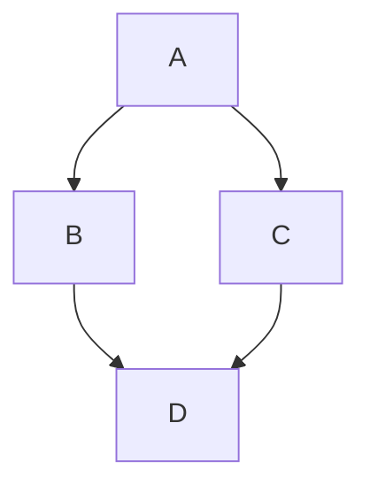

# EX02-1.py

```python
a = 2; b = 5;
c = b/a
print("ค่าของ C คือ : ",c)
c1 = b%a
print("ค่าของ C1 คือ : ",c1)
c2 = b//a
print("ค่าของ C2 คือ : ",c2)
a1 = 3+97//2
print("ค่าของ a1 คือ : ",a1)
a2 = 3+97//2**3
print("ค่าของ a2 คือ : ",a2)
a3 = 3+97//2**3%8
print("ค่าของ a3 คือ : ",a3)
```
Diagram flow chart:


อย่าลืมทำตามลำดับนะครับ! :star:


[ex02_02.py]
```python
name = input("กรอกชื่อลูกค้า ")
print("ลูกค้าชื่อ :" , name)
price = float(input("ราคาสินค้า :" ))
vat =0.07
tPrice = (price*vat)+price
print("ราคาสินค้า รวมภาษี7%  : ",tPrice)
```
output EX02-02.py


[EX02_01-inputName.py]()

```python
print("สวัสดี Python")
name = input("ป้อนชื่อของคุณ >>> ")
print("ยินดีต้อนรับ! " + name)

```


```python


```
output [ ]

```python


```


```python


```


```
output [ ]

```python

```

```python

```
output [ ]

```python

```
output [ ]


```python

```
