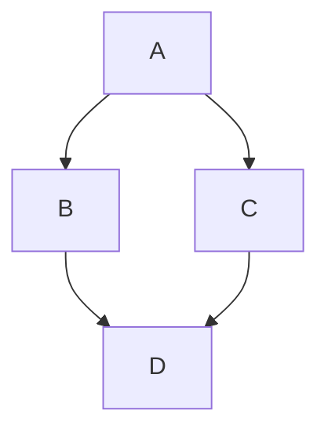

# EX02-1.py

```python
a = 2; b = 5;
c = b/a
print("ค่าของ C คือ : ",c)
c1 = b%a
print("ค่าของ C1 คือ : ",c1)
c2 = b//a
print("ค่าของ C2 คือ : ",c2)
a1 = 3+97//2
print("ค่าของ a1 คือ : ",a1)
a2 = 3+97//2**3
print("ค่าของ a2 คือ : ",a2)
a3 = 3+97//2**3%8
print("ค่าของ a3 คือ : ",a3)
```
Diagram flow chart:


อย่าลืมทำตามลำดับนะครับ! :star:


[ex02_02.py]
```python
name = input("กรอกชื่อลูกค้า ")
print("ลูกค้าชื่อ :" , name)
price = float(input("ราคาสินค้า :" ))
vat =0.07
tPrice = (price*vat)+price
print("ราคาสินค้า รวมภาษี7%  : ",tPrice)
```
output EX02-02.py


[EX02_01-inputName.py]()

```python
print("สวัสดี Python")
name = input("ป้อนชื่อของคุณ >>> ")
print("ยินดีต้อนรับ! " + name)

```


[19_4-defualt_textInput.py](https://github.com/user-attachments/files/22078597/19_4-defualt_textInput.py)


```python
import tkinter

window = tkinter.Tk()
window.minsize(400, 300)
window.title('My App 19-4.py')
window.config(pady=30)

my_title = tkinter.Label()
my_title.config(font=('Helvetica', 30, 'bold'), fg='orange')
my_title.config(text='Default Text')
my_title.pack()
sv = tkinter.StringVar()
sv.set('')
my_box = tkinter.Entry()
my_box.config(width=20, textvariable=sv)
my_box.pack(expand=True)

def callback(*args):
    my_title['text'] = sv.get()

sv.trace_add('write', callback=callback)
window.mainloop()

```


[19_5-buttonAdd_textbox.py](https://github.com/user-attachments/files/22078603/19_5-buttonAdd_textbox.py)

```python
import tkinter

window = tkinter.Tk()
window.minsize(400, 300)
window.title('My ajRatiwat App19-5')
window.config(padx=20, pady=20)
my_box = tkinter.Entry(width=30)

def add_handler():
    my_box.insert(tkinter.END, 'สวัสดี น.ศIT67-03!>> ')

def clear_handler():
    my_box.delete(0, tkinter.END)

add = tkinter.Button(text='Add', command=add_handler)
clear = tkinter.Button(text='Clear', command=clear_handler)
my_box.pack()
add.pack()
clear.pack()

window.mainloop()

```


[19_6-textbox-mutipleline.py](https://github.com/user-attachments/files/22078591/19_6-textbox-mutipleline.py)

```python
import tkinter

window = tkinter.Tk()
window.minsize(400, 300)
window.title('My App')

multiline_box = tkinter.Text(master=window)
multiline_box.config(width=30, height=5)
multiline_box.focus()
multiline_box.insert(tkinter.END, 'อ.รติวัฒน์ บรรทัดที่ 1.')
multiline_box.insert(tkinter.INSERT, '\nผศ.ดร.ธงรบ บรรทัดที่ 2.')
multiline_box.insert(tkinter.INSERT, '\nผศ.ไพทูรย์ บรรทัดที่ 3.')
# multiline_box.tag_add('second', '4.0', '4.9')
#multiline_box.tag_config('second', background='blue', foreground='white')
multiline_box.tag_add('third', '3.0', '3.9')
multiline_box.tag_config('third', background='#000FFF', foreground='white')
multiline_box.pack(expand=True)

window.mainloop()


```


[19_8-spinbox.py](https://github.com/user-attachments/files/22078592/19_8-spinbox.py)
```python

import tkinter

window = tkinter.Tk()
window.minsize(400, 300)
window.title('App SprinBox by ajRatiwat')

vi = tkinter.StringVar()
vi.set('9')
label = tkinter.Label(text=vi.get())
label.config(font=('Cosmic', 30, 'bold'))
label.pack()

def update_label():
    label['text'] = vi.get()  

spin = tkinter.Spinbox(from_=1, to=10, command=update_label, textvariable=vi)
spin.pack()

window.mainloop()
```


[19-9]
```python
import tkinter

window = tkinter.Tk()
window.minsize(400, 300)
window.title('My Scale-number')
vi = tkinter.IntVar()
vi.set(100)
label = tkinter.Label(text=vi.get())
label.config(font=('Arial', 40, 'bold'))
label.pack()

def update_label(value):
    label['text'] = value

spin = tkinter.Scale(from_=1, to=200, command=update_label, variable=vi)
spin.pack()

window.mainloop()
```
output 19-9


[19_11-listbox.py](https://github.com/user-attachments/files/22078599/19_11-listbox.py)
```python
import tkinter

window = tkinter.Tk()
window.minsize(400, 300)
window.title('My App')

label = tkinter.Label()
label.config(font=('Arial', 14, 'bold'))
data = ['INFO212', 'INFO363', 'INFO262', 'INFO354']
computer_list = tkinter.Listbox(
    height=len(data),
    selectmode=tkinter.MULTIPLE
)

def list_selected(event):
    selected_list = computer_list.curselection()
    result = [data[selected] for selected in selected_list]
    label['text'] = ', '.join(result)

computer_list.bind("<<ListboxSelect>>", list_selected)

for mac in data:
    computer_list.insert(data.index(mac), mac)

computer_list.pack()
label.pack()

window.mainloop()

```


[19_12-scroller-Listbox.py](https://github.com/user-attachments/files/22078595/19_12-scroller-Listbox.py)
```python

```
[19_13-messagebox.py](https://github.com/user-attachments/files/22078584/19_13-messagebox.py)
```python

```
[19_10-radiobutton.py](https://github.com/user-attachments/files/22078585/19_10-radiobutton.py)
```python

```
[19_7-checkbutton.py](https://github.com/user-attachments/files/22078593/19_7-checkbutton.py)
```python
import tkinter

window = tkinter.Tk()
window.minsize(400, 300)
window.title('My App')
vi = tkinter.IntVar()
label = tkinter.Label()
label.config(text='พิซซ่า', font=('Arial', 40, 'bold'))
label.pack()

def update_label():
    if vi.get() == 1:
        label['text'] = 'พิซซ่า + เพิ่มชีส'
    else:
        label['text'] = 'พิซซ่า'

check = tkinter.Checkbutton(text='เพิ่มชีส', command=update_label, variable=vi)
check.pack()
window.mainloop()
```


[19_9-scale-number1-100.py](https://github.com/user-attachments/files/22078602/19_9-scale-number1-100.py)
```python

```