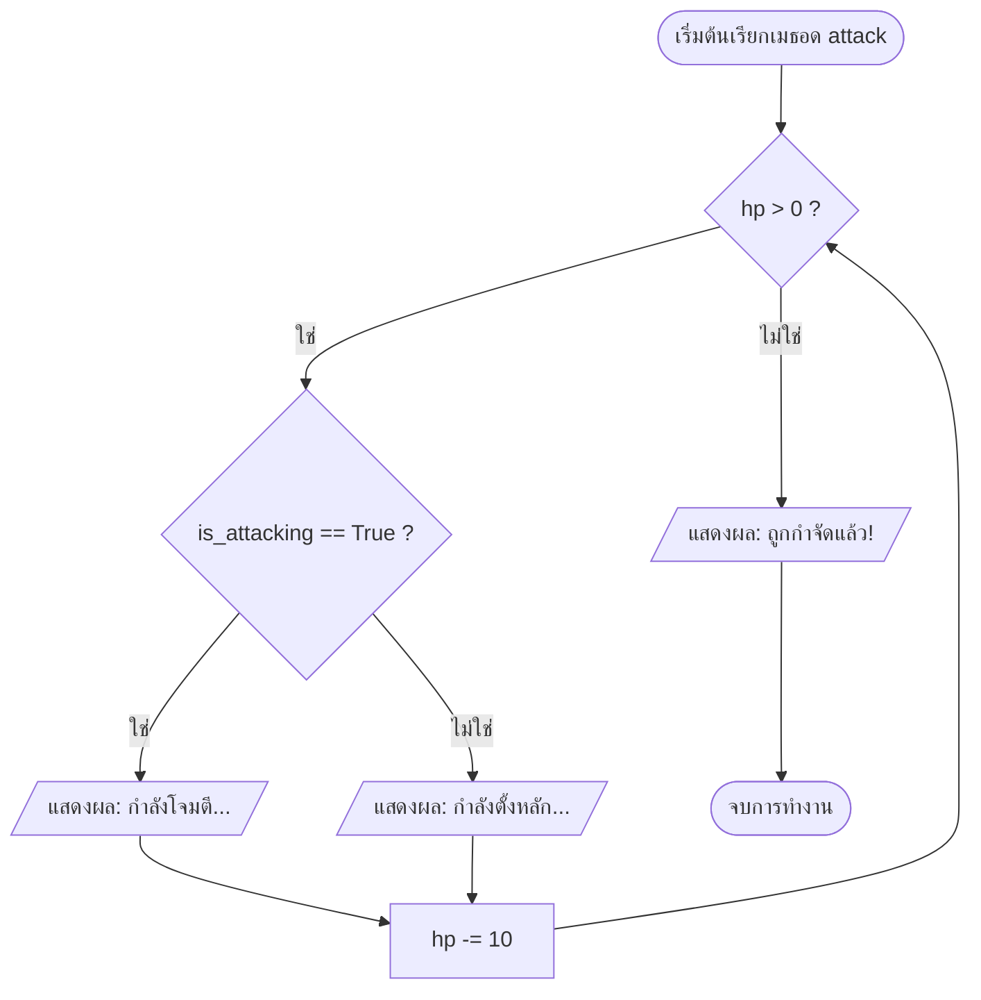
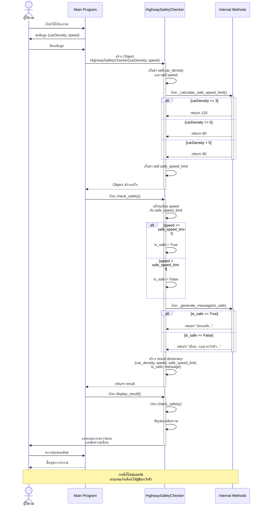
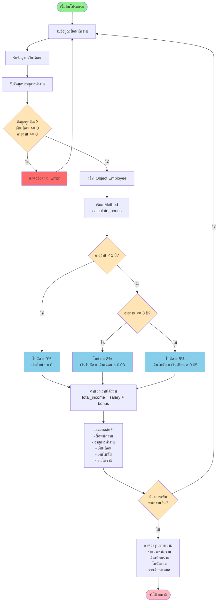
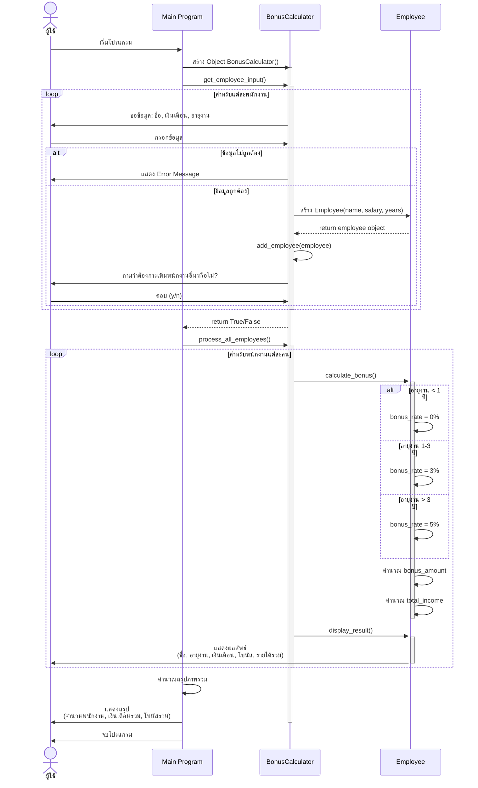

# [exam_job3.py]
example =>> Math แบบ OOP

```python
import math

class GeometryCalculator:
    """คลาสหลักสำหรับคำนวณเรขาคณิต"""
    
    # ค่าคงที่ Pi
    PI = 3.1416
    
    def __init__(self):
        """Constructor"""
        pass
    
    def get_positive_input(self, prompt):
        """รับค่าจากผู้ใช้และตรวจสอบว่าเป็นค่าบวก"""
        while True:
            try:
                value = float(input(prompt))
                if value > 0:
                    return value
                else:
                    print("กรุณาป้อนค่าที่มากกว่า 0")
            except ValueError:
                print("กรุณาป้อนตัวเลขที่ถูกต้อง")


class Sphere(GeometryCalculator):
    """คลาสสำหรับคำนวณทรงกลม"""
    
    def __init__(self, radius):
        """
        Constructor
        Parameters:
            radius (float): รัศมีของทรงกลม
        """
        super().__init__()
        self.radius = radius
    
    def calculate_volume(self):
        """
        คำนวณปริมาตรทรงกลม
        สูตร: V = (4/3) * π * r³
        Returns:
            float: ปริมาตรทรงกลม
        """
        volume = (4/3) * self.PI * (self.radius ** 3)
        return volume
    
    def calculate_surface_area(self):
        """
        คำนวณพื้นที่ผิวทรงกลม
        สูตร: A = 4 * π * r²
        Returns:
            float: พื้นที่ผิวทรงกลม
        """
        surface_area = 4 * self.PI * (self.radius ** 2)
        return surface_area
    
    def display_results(self):
        """แสดงผลลัพธ์การคำนวณ"""
        print(f"\n--- ทรงกลม ---")
        print(f"รัศมี (r) = {self.radius:.2f} หน่วย")
        print(f"ปริมาตร = {self.calculate_volume():.4f} ลูกบาศก์หน่วย")
        print(f"พื้นที่ผิว = {self.calculate_surface_area():.4f} ตารางหน่วย")


class Cylinder(GeometryCalculator):
    """คลาสสำหรับคำนวณทรงกระบอก"""
    
    def __init__(self, radius, height):
        """
        Constructor
        Parameters:
            radius (float): รัศมีของทรงกระบอก
            height (float): ความสูงของทรงกระบอก
        """
        super().__init__()
        self.radius = radius
        self.height = height
    
    def calculate_volume(self):
        """
        คำนวณปริมาตรทรงกระบอก
        สูตร: V = π * r² * h
        Returns:
            float: ปริมาตรทรงกระบอก
        """
        volume = self.PI * (self.radius ** 2) * self.height
        return volume
    
    def display_results(self):
        """แสดงผลลัพธ์การคำนวณ"""
        print(f"\n--- ทรงกระบอก ---")
        print(f"รัศมี (r) = {self.radius:.2f} หน่วย")
        print(f"ความสูง (h) = {self.height:.2f} หน่วย")
        print(f"ปริมาตร = {self.calculate_volume():.4f} ลูกบาศก์หน่วย")


class MainProgram:
    """คลาสหลักสำหรับรันโปรแกรม"""
    
    def __init__(self):
        """Constructor"""
        self.calculator = GeometryCalculator()
    
    def show_menu(self):
        """แสดงเมนูหลัก"""
        print("\n" + "="*50)
        print("โปรแกรมคำนวณเรขาคณิต 3 มิติ")
        print("="*50)
        print("1. คำนวณปริมาตรทรงกลม")
        print("2. คำนวณพื้นที่ผิวทรงกลม")
        print("3. คำนวณปริมาตรทรงกระบอก")
        print("4. ออกจากโปรแกรม")
        print("="*50)
    
    def run(self):
        """เรียกใช้งานโปรแกรมหลัก"""
        while True:
            self.show_menu()
            choice = input("เลือกเมนู (1-4): ")
            
            if choice == '1':
                # คำนวณปริมาตรทรงกลม
                r = self.calculator.get_positive_input("ป้อนรัศมีของทรงกลม (r): ")
                sphere = Sphere(r)
                print(f"\nปริมาตรทรงกลม = {sphere.calculate_volume():.4f} ลูกบาศก์หน่วย")
                
            elif choice == '2':
                # คำนวณพื้นที่ผิวทรงกลม
                r = self.calculator.get_positive_input("ป้อนรัศมีของทรงกลม (r): ")
                sphere = Sphere(r)
                print(f"\nพื้นที่ผิวทรงกลม = {sphere.calculate_surface_area():.4f} ตารางหน่วย")
                
            elif choice == '3':
                # คำนวณปริมาตรทรงกระบอก
                r = self.calculator.get_positive_input("ป้อนรัศมีของทรงกระบอก (r): ")
                h = self.calculator.get_positive_input("ป้อนความสูงของทรงกระบอก (h): ")
                cylinder = Cylinder(r, h)
                print(f"\nปริมาตรทรงกระบอก = {cylinder.calculate_volume():.4f} ลูกบาศก์หน่วย")
                
            elif choice == '4':
                print("\nขอบคุณที่ใช้งานโปรแกรม")
                break
                
            else:
                print("\nกรุณาเลือกเมนู 1-4 เท่านั้น")


# เรียกใช้งานโปรแกรม
if __name__ == "__main__":
    program = MainProgram()
    program.run()

```
output out_ex5-if-oop.py


Diagram flow chart:
```mermaid

```
[.py]
```python


```

```mermaid
graph TD
 
```
[.py]
```python


```
Flowchart Diagram

[.py]
```python


```
```mermaid
flowchart TD
   
```


```python

```
[exam_job412.py โจทย์ในแบบฝึกหัดที่4.12 ใน Classroom]
```python

```
```mermaid
flowchart TD
 
    
```
flow แบบ  Sequence Diagram (Mermaid Diagram)



[ex_job4122-classroom.py :>> classroom 2-68]
```python

  
```



flow Sequence Diagram ระบบการคำนวณโบนัสพนักงาน



```python

    
```

```mermaid

    
```
```mermaid

    
```

```mermaid
graph TD
    
```