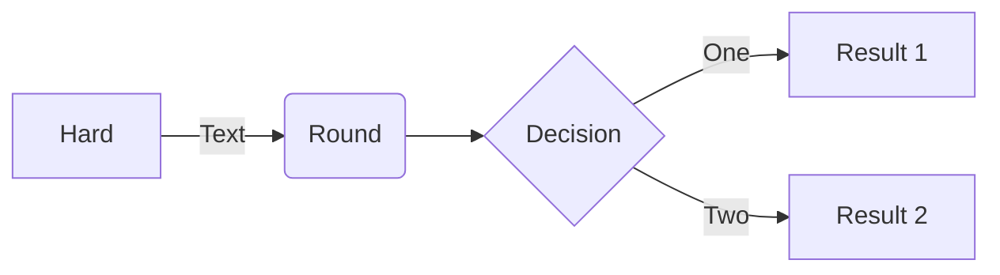

# Ex05-01-01if_one.py

```python
score1 = int(input("กรุณากรอกคะแนน :>>"))
# score1 = 40
if score1 >= 50:
    print("คุณสอบแล้ว นะจ๊ะ :" , score1 , "ดีใจด้วย")
#    print("OK")
# print("Bye")


[ex05-if-oop.py]
```python
class Person:
    def __init__(self, name, age):
        self.name = name
        self.age = age

    def can_vote(self):
        if self.age >= 50:
            return f"{self.name} สามารถลงคะแนนได้"
        else:
            return f"{self.name} ยังไม่สามารถลงคะแนนได้"

# สร้าง Object
person1 = Person("aj@Ratiwat", 59)
person2 = Person("ผศ.ดร.ธงรบ", 48)
person3 = Person("นางสาวสุดารัตน์", 30)
person4 = Person("นายสมชาย", 50)
print(person1.can_vote()) # Output: aj@Ratiwat สามารถลงคะแนนได้
print(person2.can_vote()) # Output: ผศ.ดร.ธงรบ ยังไม่สามารถลงคะแนนได้
print(person3.can_vote()) # Output: นางสาวสุดารัตน์ ยังไม่สามารถลงคะแนนได้
print(person4.can_vote()) # Output: นายสมชาย สามารถลงคะแนนได้

```
output out_ex5-if-oop.py


```
Diagram flow chart:


อย่าลืมทำตามลำดับนะครับ! :star:


```mermaid
flowchart TD
    A[เริ่มต้นสร้าง Player] --> B[กำหนดค่า health = 100]
    B --> C[is_alive = True]
    C --> D[เรียกใช้ take_damage(damage)]
    D --> E[health = health - damage]
    E --> F{health <= 0 ?}

    F -- ใช่ --> G[is_alive = False]
    G --> H[แสดงข้อความ: ถูกกำจัดแล้ว]

    F -- ไม่ใช่ --> I[แสดงข้อความ: เหลือพลังชีวิต]
```
```geojson
{
  "type": "FeatureCollection",
  "features": [
    {
      "type": "Feature",
      "id": 1,
      "properties": {
        "ID": 0
      },
      "geometry": {
        "type": "Polygon",
        "coordinates": [
          [
              [-90,35],
              [-90,30],
              [-85,30],
              [-85,35],
              [-90,35]
          ]
        ]
      }
    }
  ]
}
```
[ex5-if-oop2.py]()

```python
class Player:
    def __init__(self, name):
        self.name = name
        self.health = 100
        self.is_alive = True

    def take_damage(self, damage):
        self.health -= damage
        if self.health <= 0:
            self.is_alive = False
            print(f"{self.name} ถูกกำจัดแล้ว!")
        else:
            print(f"{self.name} เหลือพลังชีวิต {self.health}")

player1 = Player("Hero")
player1.take_damage(50)
player1.take_damage(60) # เงื่อนไข is_alive จะถูกเปลี่ยนเป็น False


```
[out_ex5-if-oop2.jpg]


[Ex05-04-if-else.py]


```python
print("เมนูตัวดำเนินการ")
print("1. บวก")
print("2. ลบ")
print("3. คูณ")
print("4. หาร")
print("5. หารเอาเศษ")
key = int(input("กดเลือก 1, 2, 3 , 4 หรือ 5 >>> "))
a = int(input("ป้อนข้อมูลตัวเลขที่ 1 >>> "))
b = int(input("ป้อนข้อมูลตัวเลขที่ 2 >>> "))
if key == 1:
    print("ผลบวกของ", a, "+", b, "=", (a + b))
elif key == 2:
    print("ผลลบของ", a, "-", b, "=", (a - b))
elif key == 3:
    print("ผลคูณของ", a, "*", b, "=", (a * b))
elif key == 4:
    print("ผลหารของ", a, "/", b, "=", (a / b))
elif key == 5:
    print("ผลหารเอาเศษ ", a, "%", b, "=", (a % b))
else:
    print("พบข้อผิดพลาดในการเลือกตัวดำเนินการ!")
print("แล้วเจอกันใหม่!")
```
[out_EX05-04-if-else-v1.jpg]


[19_5-buttonAdd_textbox.py](https://github.com/user-attachments/files/22078603/19_5-buttonAdd_textbox.py)

# ตัวอย่างโค้ด Python: Class Player

โค้ดตัวอย่างนี้แสดงการสร้างคลาส Player และการทำงานของฟังก์ชัน take_damage

```python
class Player:
    def __init__(self, name):
        self.name = name
        self.health = 100
        self.is_alive = True

    def take_damage(self, damage):
        self.health -= damage
        if self.health <= 0:
            self.is_alive = False
            print(f"{self.name} ถูกกำจัดแล้ว!")
        else:
            print(f"{self.name} เหลือพลังชีวิต {self.health}")


player1 = Player("Hero")
player1.take_damage(50)
player1.take_damage(60)  # เงื่อนไข is_alive จะถูกเปลี่ยนเป็น False
```
คำอธิบาย

คลาส Player ใช้เก็บข้อมูลของตัวละคร

มีคุณสมบัติ (attribute):

name = ชื่อผู้เล่น

health = ค่าพลังชีวิตเริ่มต้นที่ 100

is_alive = สถานะว่ายังมีชีวิตอยู่หรือไม่

เมธอด take_damage() ใช้ลดค่าพลังชีวิต และตรวจสอบว่าผู้เล่นตายหรือยัง

[flow chart algroithum ของ file นี้]

### Flowchart (Mermaid)

```mermaid
flowchart TD
    A[เริ่มต้นสร้าง Player] --> B[กำหนดค่า health = 100]
    B --> C[is_alive = True]
    C --> D[เรียกใช้ take_damage(damage)]
    D --> E[health = health - damage]
    E --> F{health <= 0 ?}

    F -- ใช่ --> G[is_alive = False]
    G --> H[แสดงข้อความ: ถูกกำจัดแล้ว]

    F -- ไม่ใช่ --> I[แสดงข้อความ: เหลือพลังชีวิต]
```


[19_6-textbox-mutipleline.py](https://github.com/user-attachments/files/22078591/19_6-textbox-mutipleline.py)

```python
import tkinter

window = tkinter.Tk()
window.minsize(400, 300)
window.title('My App')

multiline_box = tkinter.Text(master=window)
multiline_box.config(width=30, height=5)
multiline_box.focus()
multiline_box.insert(tkinter.END, 'อ.รติวัฒน์ บรรทัดที่ 1.')
multiline_box.insert(tkinter.INSERT, '\nผศ.ดร.ธงรบ บรรทัดที่ 2.')
multiline_box.insert(tkinter.INSERT, '\nผศ.ไพทูรย์ บรรทัดที่ 3.')
# multiline_box.tag_add('second', '4.0', '4.9')
#multiline_box.tag_config('second', background='blue', foreground='white')
multiline_box.tag_add('third', '3.0', '3.9')
multiline_box.tag_config('third', background='#000FFF', foreground='white')
multiline_box.pack(expand=True)

window.mainloop()


```


[19_8-spinbox.py](https://github.com/user-attachments/files/22078592/19_8-spinbox.py)
```python

import tkinter

window = tkinter.Tk()
window.minsize(400, 300)
window.title('App SprinBox by ajRatiwat')

vi = tkinter.StringVar()
vi.set('9')
label = tkinter.Label(text=vi.get())
label.config(font=('Cosmic', 30, 'bold'))
label.pack()

def update_label():
    label['text'] = vi.get()  

spin = tkinter.Spinbox(from_=1, to=10, command=update_label, textvariable=vi)
spin.pack()

window.mainloop()
```


[19-9]
```python
import tkinter

window = tkinter.Tk()
window.minsize(400, 300)
window.title('My Scale-number')
vi = tkinter.IntVar()
vi.set(100)
label = tkinter.Label(text=vi.get())
label.config(font=('Arial', 40, 'bold'))
label.pack()

def update_label(value):
    label['text'] = value

spin = tkinter.Scale(from_=1, to=200, command=update_label, variable=vi)
spin.pack()

window.mainloop()
```
output 19-9


[19_11-listbox.py](https://github.com/user-attachments/files/22078599/19_11-listbox.py)
```python
import tkinter

window = tkinter.Tk()
window.minsize(400, 300)
window.title('My App')

label = tkinter.Label()
label.config(font=('Arial', 14, 'bold'))
data = ['INFO212', 'INFO363', 'INFO262', 'INFO354']
computer_list = tkinter.Listbox(
    height=len(data),
    selectmode=tkinter.MULTIPLE
)

def list_selected(event):
    selected_list = computer_list.curselection()
    result = [data[selected] for selected in selected_list]
    label['text'] = ', '.join(result)

computer_list.bind("<<ListboxSelect>>", list_selected)

for mac in data:
    computer_list.insert(data.index(mac), mac)

computer_list.pack()
label.pack()

window.mainloop()

```


[19_12-scroller-Listbox.py](https://github.com/user-attachments/files/22078595/19_12-scroller-Listbox.py)
```python

```
[19_13-messagebox.py](https://github.com/user-attachments/files/22078584/19_13-messagebox.py)
```python

```
[19_10-radiobutton.py](https://github.com/user-attachments/files/22078585/19_10-radiobutton.py)
```python

```
[19_7-checkbutton.py](https://github.com/user-attachments/files/22078593/19_7-checkbutton.py)
```python
import tkinter

window = tkinter.Tk()
window.minsize(400, 300)
window.title('My App')
vi = tkinter.IntVar()
label = tkinter.Label()
label.config(text='พิซซ่า', font=('Arial', 40, 'bold'))
label.pack()

def update_label():
    if vi.get() == 1:
        label['text'] = 'พิซซ่า + เพิ่มชีส'
    else:
        label['text'] = 'พิซซ่า'

check = tkinter.Checkbutton(text='เพิ่มชีส', command=update_label, variable=vi)
check.pack()
window.mainloop()
```


[19_9-scale-number1-100.py](https://github.com/user-attachments/files/22078602/19_9-scale-number1-100.py)
```python


```


