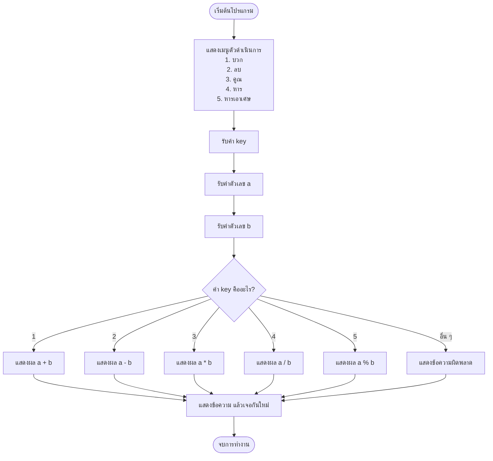
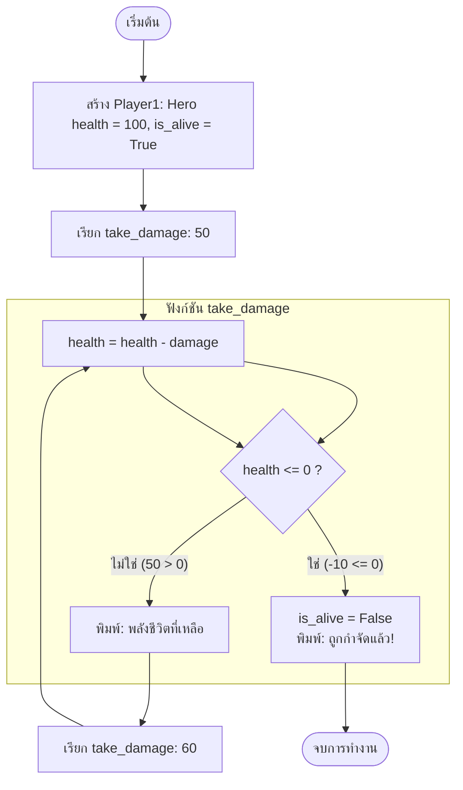
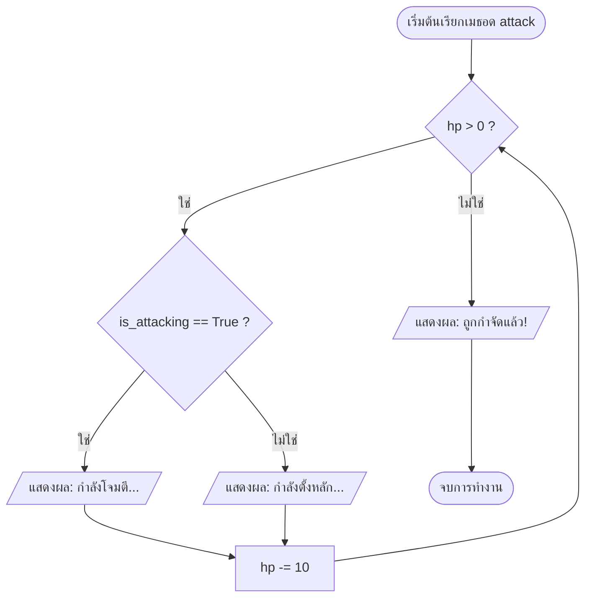
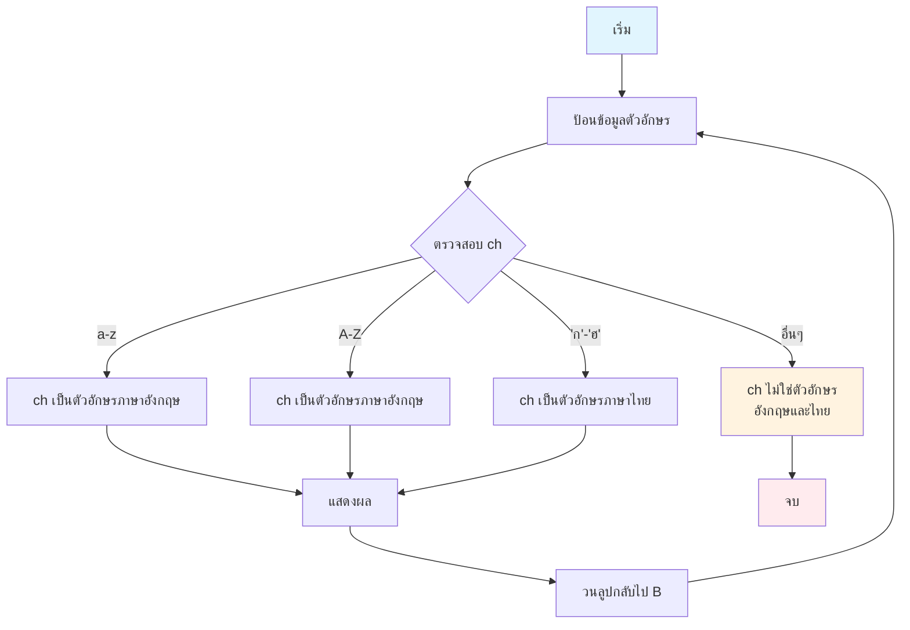
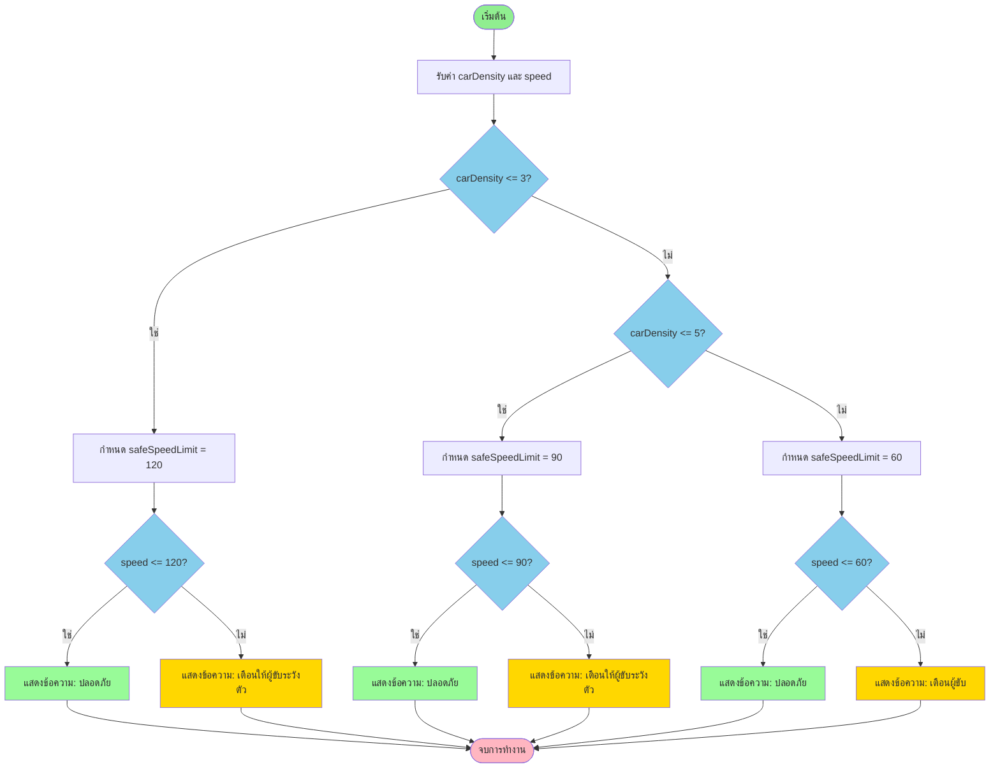
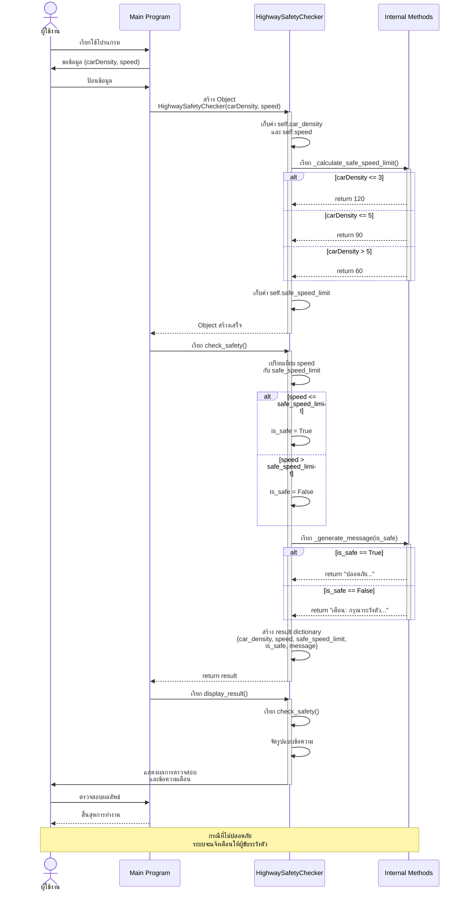
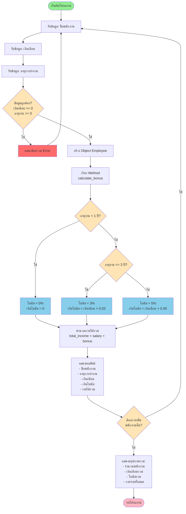
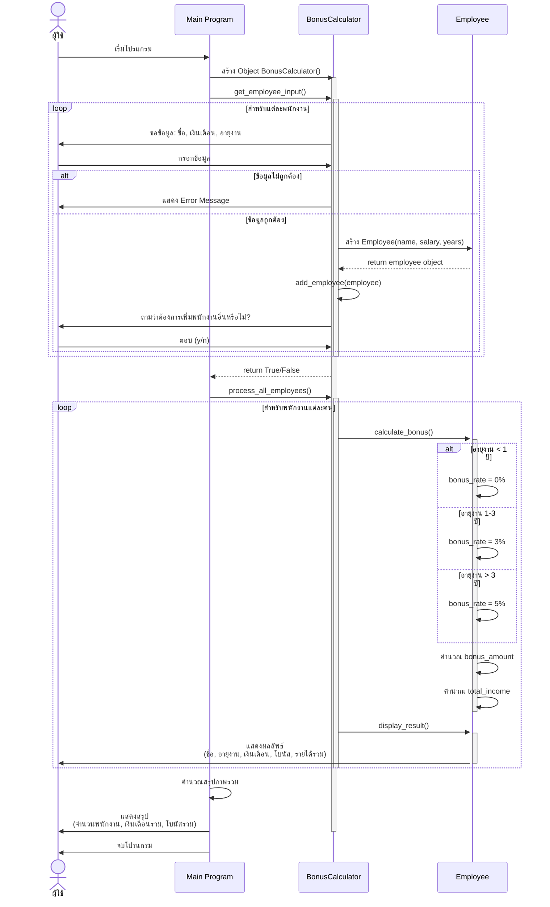

# [ex05-if-oop.py]
example =>> If..else..if..

```python
print("เมนูตัวดำเนินการ")
print("1. บวก")
print("2. ลบ")
print("3. คูณ")
print("4. หาร")
print("5. หารเอาเศษ")
key = int(input("กดเลือก 1, 2, 3 , 4 หรือ 5 >>> "))
a = int(input("ป้อนข้อมูลตัวเลขที่ 1 >>> "))
b = int(input("ป้อนข้อมูลตัวเลขที่ 2 >>> "))
if key == 1:
    print("ผลบวกของ", a, "+", b, "=", (a + b))
elif key == 2:
    print("ผลลบของ", a, "-", b, "=", (a - b))
elif key == 3:
    print("ผลคูณของ", a, "*", b, "=", (a * b))
elif key == 4:
    print("ผลหารของ", a, "/", b, "=", (a / b))
elif key == 5:
    print("ผลหารเอาเศษ", a, "%", b, "=", (a % b))
else:
    print("พบข้อผิดพลาดในการเลือกตัวดำเนินการ!")
print("แล้วเจอกันใหม่!")


```
output out_ex5-if-oop.py


Diagram flow chart:

[ex5-if-oop2.py]
```python
class Player:
    def __init__(self, name):
        self.name = name
        self.health = 100
        self.is_alive = True

    def take_damage(self, damage):
        self.health -= damage
        if self.health <= 0:
            self.is_alive = False
            print(f"{self.name} ถูกกำจัดแล้ว!")
        else:
            print(f"{self.name} เหลือพลังชีวิต {self.health}")

player1 = Player("Hero")
player1.take_damage(50)
player1.take_damage(60) # เงื่อนไข is_alive จะถูกเปลี่ยนเป็น False

```


[ex05-if-while-oop1.py]
```python
class Enemy:
    def __init__(self, name, hp):
        self.name = name
        self.hp = hp
        self.is_attacking = False

    def attack(self):
        while self.hp > 0: # ตราบใดที่ศัตรูยังไม่ตาย
            if self.is_attacking:
                print(f"{self.name} กำลังโจมตี...")
                # ตรวจสอบว่าผู้เล่นตายไหม (สมมติว่ามีเมธอด check_player_alive)
                # if not player.is_alive: break # ถ้าผู้เล่นตายให้หยุดโจมตี
            else:
                print(f"{self.name} กำลังตั้งหลัก...")
            self.hp -= 10 # ลดพลังชีวิตลง
        print(f"{self.name} ถูกกำจัดแล้ว!")

enemy = Enemy("aj@Ratiwat", 100)
enemy.is_attacking = True # ตั้งค่าให้เริ่มโจมตี
enemy.attack() # เริ่มการทำงานของเมธอด attack

```
Flowchart Diagram

[Ex05-11-While-if_break.py]
```python
while True:
    ch = input("ป้อนข้อมูลตัวอักขระ  >>> ")
    if 'a' <= ch <= 'z':
        print(ch,  "เป็นตัวอักษรในภาษาอังกฤษ")
    elif 'A' <= ch <= 'Z':
        print(ch,  "เป็นตัวอักษรในภาษาอังกฤษ")
    elif 'ก' <= ch <= 'ฮ' :
        print(ch,  "เป็นตัวอักษรในภาษาไทย")
    else:
        print(ch,  "ไม่ใช่ตัวอักษรในภาษาอังกฤษ และ ไทย")
        break

```



```python

```
[exam_job412.py โจทย์ในแบบฝึกหัดที่4.12 ใน Classroom]
```python
class HighwaySafetyChecker:
    """
    คลาสสำหรับตรวจสอบความปลอดภัยในการขับรถบนทางด่วน
    โดยพิจารณาจากความหนาแน่นของรถและความเร็ว
    """
    
    def __init__(self, car_density, speed):
        """
        กำหนดค่าเริ่มต้น
        
        Parameters:
        car_density (float): ความหนาแน่นของรถยนต์ (คัน/กม.)
        speed (float): ความเร็วของรถที่กำลังขับ (กม./ชม.)
        """
        self.car_density = car_density
        self.speed = speed
        self.safe_speed_limit = self._calculate_safe_speed_limit()
    
    def _calculate_safe_speed_limit(self):
        """
        คำนวณความเร็วสูงสุดที่ปลอดภัยตามความหนาแน่นของรถ
        
        Returns:
        int: ความเร็วสูงสุดที่ปลอดภัย (กม./ชม.)
        """
        if self.car_density <= 3:
            return 120
        elif self.car_density <= 5:
            return 90
        else:  # car_density > 5
            return 60
    
    def check_safety(self):
        """
        ตรวจสอบความปลอดภัยและแสดงข้อความเตือน
        
        Returns:
        dict: ข้อมูลผลการตรวจสอบ
        """
        is_safe = self.speed <= self.safe_speed_limit
        
        result = {
            'car_density': self.car_density,
            'current_speed': self.speed,
            'safe_speed_limit': self.safe_speed_limit,
            'is_safe': is_safe,
            'message': self._generate_message(is_safe)
        }
        
        return result
    
    def _generate_message(self, is_safe):
        """
        สร้างข้อความแจ้งเตือนตามสถานะความปลอดภัย
        
        Parameters:
        is_safe (bool): สถานะความปลอดภัย
        
        Returns:
        str: ข้อความแจ้งเตือน
        """
        if is_safe:
            return f"ปลอดภัย: ความเร็ว {self.speed} กม./ชม. อยู่ในเกณฑ์ปลอดภัย (ไม่เกิน {self.safe_speed_limit} กม./ชม.)"
        else:
            return f"เตือน: ความเร็ว {self.speed} กม./ชม. เกินความเร็วที่ปลอดภัย ({self.safe_speed_limit} กม./ชม.) กรุณาระวังตัว!"
    
    def display_result(self):
        """
        แสดงผลการตรวจสอบความปลอดภัย
        """
        result = self.check_safety()
        print("="*60)
        print("ระบบตรวจสอบความปลอดภัยการขับรถบนทางด่วน")
        print("="*60)
        print(f"ความหนาแน่นของรถ: {result['car_density']} คัน/กม.")
        print(f"ความเร็วปัจจุบัน: {result['current_speed']} กม./ชม.")
        print(f"ความเร็วที่ปลอดภัย: ≤ {result['safe_speed_limit']} กม./ชม.")
        print(f"สถานะ: {'✓ ปลอดภัย' if result['is_safe'] else '⚠ ไม่ปลอดภัย'}")
        print("-"*60)
        print(result['message'])
        print("="*60)


# ตัวอย่างการใช้งาน
if __name__ == "__main__":
    # ทดสอบกรณีต่างๆ
    test_cases = [
        (2, 100),   # ความหนาแน่นต่ำ, ความเร็วปลอดภัย
        (2, 140),   # ความหนาแน่นต่ำ, ความเร็วเกิน
        (4, 85),    # ความหนาแน่นปานกลาง, ความเร็วปลอดภัย
        (4, 100),   # ความหนาแน่นปานกลาง, ความเร็วเกิน
        (6, 55),    # ความหนาแน่นสูง, ความเร็วปลอดภัย
        (7, 70),    # ความหนาแน่นสูง, ความเร็วเกิน
    ]
    
    print("\n🚗 ทดสอบระบบตรวจสอบความปลอดภัย\n")
    
    for density, speed in test_cases:
        checker = HighwaySafetyChecker(density, speed)
        checker.display_result()
        print()
    
    # ตัวอย่างการรับค่าจากผู้ใช้
    print("\n📝 ป้อนข้อมูลของคุณ:")
    try:
        user_density = float(input("ความหนาแน่นของรถ (คัน/กม.): "))
        user_speed = float(input("ความเร็วปัจจุบัน (กม./ชม.): "))
        
        user_checker = HighwaySafetyChecker(user_density, user_speed)
        print()
        user_checker.display_result()
    except ValueError:
        print("กรุณาป้อนตัวเลขที่ถูกต้อง")
```

flow แบบ  Sequence Diagram (Mermaid Diagram)

คำอธิบาย
1. โค้ด Python แบบ OOP ประกอบด้วย:

Class HighwaySafetyChecker มีคุณสมบัติครบถ้วน
Constructor (__init__) สำหรับรับค่าและกำหนดค่าเริ่มต้น
Private Method (_calculate_safe_speed_limit) คำนวณความเร็วที่ปลอดภัย
Public Method (check_safety) ตรวจสอบและคืนค่าผลลัพธ์
Display Method แสดงผลแบบเป็นระบบ
มีตัวอย่างการใช้งานพร้อมทดสอบหลายกรณี

2. Flowchart แสดง:

การไหลของโปรแกรมตั้งแต่เริ่มต้นจนจบ
เงื่อนไขการตรวจสอบความหนาแน่นของรถ (3 ระดับ)
การตรวจสอบความเร็วและแสดงผลที่เหมาะสม
ใช้สีแยกประเภท (เขียว=ปลอดภัย, เหลือง=เตือน)

3. Sequence Diagram แสดง:

ลำดับการทำงานระหว่าง User, Main Program และ Object
การสื่อสารระหว่าง Methods ภายใน Class
Flow ของข้อมูลตั้งแต่รับค่าจนแสดงผล
เงื่อนไขการตัดสินใจในแต่ละขั้นตอน

[ex_job4122-classroom.py :>> classroom 2-68]
```python
class Employee:
    """คลาสสำหรับจัดการข้อมูลพนักงานและคำนวณโบนัส"""
    
    def __init__(self, name, salary, years_of_service):
        """
        สร้างอ็อบเจ็กต์พนักงาน
        
        Parameters:
        name (str): ชื่อพนักงาน
        salary (float): เงินเดือน
        years_of_service (float): อายุการทำงาน (ปี)
        """
        self.name = name
        self.salary = salary
        self.years_of_service = years_of_service
        self.bonus_rate = 0
        self.bonus_amount = 0
        self.total_income = 0
    
    def calculate_bonus(self):
        """คำนวณโบนัสตามอายุการทำงาน"""
        if self.years_of_service < 1:
            self.bonus_rate = 0
        elif 1 <= self.years_of_service <= 3:
            self.bonus_rate = 0.03  # 3%
        else:  # มากกว่า 3 ปี
            self.bonus_rate = 0.05  # 5%
        
        self.bonus_amount = self.salary * self.bonus_rate
        self.total_income = self.salary + self.bonus_amount
    
    def display_result(self):
        """แสดงผลการคำนวณ"""
        print("\n" + "="*50)
        print(f"ชื่อพนักงาน: {self.name}")
        print(f"อายุการทำงาน: {self.years_of_service} ปี")
        print(f"เงินเดือน: {self.salary:,.2f} บาท")
        
        if self.bonus_rate == 0:
            print("สถานะ: ไม่ได้รับโบนัส (อายุงานน้อยกว่า 1 ปี)")
        else:
            print(f"อัตราโบนัส: {self.bonus_rate * 100}%")
            print(f"เงินโบนัส: {self.bonus_amount:,.2f} บาท")
            print(f"รายได้รวม: {self.total_income:,.2f} บาท")
        print("="*50)


class BonusCalculator:
    """คลาสสำหรับจัดการระบบคำนวณโบนัส"""
    
    def __init__(self):
        self.employees = []
    
    def add_employee(self, employee):
        """เพิ่มพนักงานเข้าระบบ"""
        self.employees.append(employee)
    
    def process_all_employees(self):
        """ประมวลผลและแสดงผลพนักงานทั้งหมด"""
        for employee in self.employees:
            employee.calculate_bonus()
            employee.display_result()
    
    def get_employee_input(self):
        """รับข้อมูลพนักงานจากผู้ใช้"""
        print("\n*** โปรแกรมคำนวณโบนัสพนักงาน ***")
        
        while True:
            try:
                name = input("\nชื่อพนักงาน: ")
                salary = float(input("เงินเดือน (บาท): "))
                years = float(input("อายุการทำงาน (ปี): "))
                
                if salary < 0 or years < 0:
                    print("⚠️ กรุณากรอกค่าที่เป็นบวก")
                    continue
                
                employee = Employee(name, salary, years)
                self.add_employee(employee)
                
                continue_input = input("\nต้องการเพิ่มพนักงานคนอื่นหรือไม่? (y/n): ")
                if continue_input.lower() != 'y':
                    break
                    
            except ValueError:
                print("⚠️ กรุณากรอกตัวเลขที่ถูกต้อง")
            except KeyboardInterrupt:
                print("\n\nโปรแกรมถูกยกเลิก")
                return False
        
        return True


# โปรแกรมหลัก
if __name__ == "__main__":
    calculator = BonusCalculator()
    
    if calculator.get_employee_input():
        print("\n\n*** ผลการคำนวณโบนัส ***")
        calculator.process_all_employees()
        
        # สรุปภาพรวม
        print("\n\n*** สรุปภาพรวม ***")
        print(f"จำนวนพนักงานทั้งหมด: {len(calculator.employees)} คน")
        total_salary = sum(emp.salary for emp in calculator.employees)
        total_bonus = sum(emp.bonus_amount for emp in calculator.employees)
        print(f"เงินเดือนรวม: {total_salary:,.2f} บาท")
        print(f"โบนัสรวม: {total_bonus:,.2f} บาท")
        print(f"รายจ่ายทั้งหมด: {total_salary + total_bonus:,.2f} บาท")
  
```



flow Sequence Diagram ระบบการคำนวณโบนัสพนักงาน

สรุปคุณสมบัติของโปรแกรม
✨ จุดเด่นของโค้ด OOP:

Class Employee - จัดการข้อมูลและการคำนวณของพนักงานแต่ละคน

Attributes: ชื่อ, เงินเดือน, อายุงาน, อัตราโบนัส
Methods: calculate_bonus(), display_result()


Class BonusCalculator - จัดการระบบโดยรวม

เก็บรายการพนักงานทั้งหมด
รับข้อมูลจากผู้ใช้
ประมวลผลและแสดงผลรวม


เงื่อนไขการคำนวณโบนัส:

อายุงาน < 1 ปี → โบนัส 0%
อายุงาน 1-3 ปี → โบนัส 3%
อายุงาน > 3 ปี → โบนัส 5%


ระบบตรวจสอบข้อมูล:

ตรวจสอบค่าที่กรอกต้องเป็นตัวเลขบวก
จัดการ Error ด้วย try-except
รองรับการยกเลิกโปรแกรม (Ctrl+C)

```python

    
```

```mermaid

    
```
```mermaid

    
```

```mermaid
graph TD
    
```