```mermaid
flowchart TD
    A[เริ่ม] --> B[ป้อนข้อมูลตัวอักษร]
    B --> C{ตรวจสอบ ch}
    C -->|a-z| D[ch เป็นตัวอักษรภาษาอังกฤษ]
    C -->|A-Z| E[ch เป็นตัวอักษรภาษาอังกฤษ]
    C -->|'ก'-'ฮ'| F[ch เป็นตัวอักษรภาษาไทย]
    C -->|อื่นๆ| G[ch ไม่ใช่ตัวอักษร<br/>อังกฤษและไทย]
    
    D --> H[แสดงผล]
    E --> H
    F --> H
    G --> I[จบ]
    
    H --> J[วนลูปกลับไป B]
    J --> B
    
    style A fill:#e1f5fe
    style I fill:#ffebee
    style G fill:#fff3e0

```

# [ex05-if-oop.py]
example =>> If..else..if..

```python
print("เมนูตัวดำเนินการ")
print("1. บวก")
print("2. ลบ")
print("3. คูณ")
print("4. หาร")
print("5. หารเอาเศษ")
key = int(input("กดเลือก 1, 2, 3 , 4 หรือ 5 >>> "))
a = int(input("ป้อนข้อมูลตัวเลขที่ 1 >>> "))
b = int(input("ป้อนข้อมูลตัวเลขที่ 2 >>> "))
if key == 1:
    print("ผลบวกของ", a, "+", b, "=", (a + b))
elif key == 2:
    print("ผลลบของ", a, "-", b, "=", (a - b))
elif key == 3:
    print("ผลคูณของ", a, "*", b, "=", (a * b))
elif key == 4:
    print("ผลหารของ", a, "/", b, "=", (a / b))
elif key == 5:
    print("ผลหารเอาเศษ", a, "%", b, "=", (a % b))
else:
    print("พบข้อผิดพลาดในการเลือกตัวดำเนินการ!")
print("แล้วเจอกันใหม่!")


```
output out_ex5-if-oop.py


Diagram flow chart:

```mermaid
flowchart TD
    A([เริ่มต้นโปรแกรม])
    B[แสดงเมนูตัวดำเนินการ<br/>1. บวก<br/>2. ลบ<br/>3. คูณ<br/>4. หาร<br/>5. หารเอาเศษ]
    
    C[รับค่า key]
    D[รับค่าตัวเลข a]
    E[รับค่าตัวเลข b]
    F{ค่า key คืออะไร?}

    G[แสดงผล a + b]
    H[แสดงผล a - b]
    I[แสดงผล a * b]
    J[แสดงผล a / b]
    K[แสดงผล a % b]
    L[แสดงข้อความผิดพลาด]
    M[แสดงข้อความ แล้วเจอกันใหม่]
     N([จบการทำงาน])
    A --> B --> C --> D --> E --> F
    F -->|1| G --> M
    F -->|2| H --> M
    F -->|3| I --> M
    F -->|4| J --> M
    F -->|5| K --> M
    F -->|อื่น ๆ| L --> M
    M --> N
```

[ex5-if-oop2.py]
```python
class Player:
    def __init__(self, name):
        self.name = name
        self.health = 100
        self.is_alive = True

    def take_damage(self, damage):
        self.health -= damage
        if self.health <= 0:
            self.is_alive = False
            print(f"{self.name} ถูกกำจัดแล้ว!")
        else:
            print(f"{self.name} เหลือพลังชีวิต {self.health}")

player1 = Player("Hero")
player1.take_damage(50)
player1.take_damage(60) # เงื่อนไข is_alive จะถูกเปลี่ยนเป็น False

```


```mermaid
graph TD
    Start([เริ่มต้น]) --> Init[สร้าง Player1: Hero <br/>health = 100, is_alive = True]
    
    Init --> Call1[เรียก take_damage: 50]
    
    subgraph Damage_Logic [ฟังก์ชัน take_damage]
        Process[health = health - damage]
        Check{health <= 0 ?}
        Dead[is_alive = False <br/>พิมพ์: ถูกกำจัดแล้ว!]
        Alive[พิมพ์: พลังชีวิตที่เหลือ]
    end

    Call1 --> Process
    Process --> Check
    Check -- ไม่ใช่ (50 > 0) --> Alive
    Alive --> Call2[เรียก take_damage: 60]
    
    Call2 --> Process
    Process --> Check
    Check -- ใช่ (-10 <= 0) --> Dead
    
    Dead --> End([จบการทำงาน])
```

[ex05-if-while-oop1.py]
```python
class Enemy:
    def __init__(self, name, hp):
        self.name = name
        self.hp = hp
        self.is_attacking = False

    def attack(self):
        while self.hp > 0: # ตราบใดที่ศัตรูยังไม่ตาย
            if self.is_attacking:
                print(f"{self.name} กำลังโจมตี...")
                # ตรวจสอบว่าผู้เล่นตายไหม (สมมติว่ามีเมธอด check_player_alive)
                # if not player.is_alive: break # ถ้าผู้เล่นตายให้หยุดโจมตี
            else:
                print(f"{self.name} กำลังตั้งหลัก...")
            self.hp -= 10 # ลดพลังชีวิตลง
        print(f"{self.name} ถูกกำจัดแล้ว!")

enemy = Enemy("aj@Ratiwat", 100)
enemy.is_attacking = True # ตั้งค่าให้เริ่มโจมตี
enemy.attack() # เริ่มการทำงานของเมธอด attack

```
Flowchart Diagram

```mermaid
flowchart TD
    A([เริ่มต้นเรียกเมธอด attack]) --> B{hp > 0 ?}
    
    B -- ใช่ --> C{is_attacking == True ?}
    
    C -- ใช่ --> D[/แสดงผล: กำลังโจมตี.../]
    C -- ไม่ใช่ --> E[/แสดงผล: กำลังตั้งหลัก.../]
    
    D --> F[hp -= 10]
    E --> F
    
    F --> B
    
    B -- ไม่ใช่ --> G[/แสดงผล: ถูกกำจัดแล้ว!/]
    G --> H([จบการทำงาน])    
```

[Ex05-11-While-if_break.py]
```python
while True:
    ch = input("ป้อนข้อมูลตัวอักขระ  >>> ")
    if 'a' <= ch <= 'z':
        print(ch,  "เป็นตัวอักษรในภาษาอังกฤษ")
    elif 'A' <= ch <= 'Z':
        print(ch,  "เป็นตัวอักษรในภาษาอังกฤษ")
    elif 'ก' <= ch <= 'ฮ' :
        print(ch,  "เป็นตัวอักษรในภาษาไทย")
    else:
        print(ch,  "ไม่ใช่ตัวอักษรในภาษาอังกฤษ และ ไทย")
        break

```



```python

```
[exam_job412.py โจทย์ในแบบฝึกหัดที่4.12 ใน Classroom]
```python
class HighwaySafetyChecker:
    """
    คลาสสำหรับตรวจสอบความปลอดภัยในการขับรถบนทางด่วน
    โดยพิจารณาจากความหนาแน่นของรถและความเร็ว
    """
    
    def __init__(self, car_density, speed):
        """
        กำหนดค่าเริ่มต้น
        
        Parameters:
        car_density (float): ความหนาแน่นของรถยนต์ (คัน/กม.)
        speed (float): ความเร็วของรถที่กำลังขับ (กม./ชม.)
        """
        self.car_density = car_density
        self.speed = speed
        self.safe_speed_limit = self._calculate_safe_speed_limit()
    
    def _calculate_safe_speed_limit(self):
        """
        คำนวณความเร็วสูงสุดที่ปลอดภัยตามความหนาแน่นของรถ
        
        Returns:
        int: ความเร็วสูงสุดที่ปลอดภัย (กม./ชม.)
        """
        if self.car_density <= 3:
            return 120
        elif self.car_density <= 5:
            return 90
        else:  # car_density > 5
            return 60
    
    def check_safety(self):
        """
        ตรวจสอบความปลอดภัยและแสดงข้อความเตือน
        
        Returns:
        dict: ข้อมูลผลการตรวจสอบ
        """
        is_safe = self.speed <= self.safe_speed_limit
        
        result = {
            'car_density': self.car_density,
            'current_speed': self.speed,
            'safe_speed_limit': self.safe_speed_limit,
            'is_safe': is_safe,
            'message': self._generate_message(is_safe)
        }
        
        return result
    
    def _generate_message(self, is_safe):
        """
        สร้างข้อความแจ้งเตือนตามสถานะความปลอดภัย
        
        Parameters:
        is_safe (bool): สถานะความปลอดภัย
        
        Returns:
        str: ข้อความแจ้งเตือน
        """
        if is_safe:
            return f"ปลอดภัย: ความเร็ว {self.speed} กม./ชม. อยู่ในเกณฑ์ปลอดภัย (ไม่เกิน {self.safe_speed_limit} กม./ชม.)"
        else:
            return f"เตือน: ความเร็ว {self.speed} กม./ชม. เกินความเร็วที่ปลอดภัย ({self.safe_speed_limit} กม./ชม.) กรุณาระวังตัว!"
    
    def display_result(self):
        """
        แสดงผลการตรวจสอบความปลอดภัย
        """
        result = self.check_safety()
        print("="*60)
        print("ระบบตรวจสอบความปลอดภัยการขับรถบนทางด่วน")
        print("="*60)
        print(f"ความหนาแน่นของรถ: {result['car_density']} คัน/กม.")
        print(f"ความเร็วปัจจุบัน: {result['current_speed']} กม./ชม.")
        print(f"ความเร็วที่ปลอดภัย: ≤ {result['safe_speed_limit']} กม./ชม.")
        print(f"สถานะ: {'✓ ปลอดภัย' if result['is_safe'] else '⚠ ไม่ปลอดภัย'}")
        print("-"*60)
        print(result['message'])
        print("="*60)


# ตัวอย่างการใช้งาน
if __name__ == "__main__":
    # ทดสอบกรณีต่างๆ
    test_cases = [
        (2, 100),   # ความหนาแน่นต่ำ, ความเร็วปลอดภัย
        (2, 140),   # ความหนาแน่นต่ำ, ความเร็วเกิน
        (4, 85),    # ความหนาแน่นปานกลาง, ความเร็วปลอดภัย
        (4, 100),   # ความหนาแน่นปานกลาง, ความเร็วเกิน
        (6, 55),    # ความหนาแน่นสูง, ความเร็วปลอดภัย
        (7, 70),    # ความหนาแน่นสูง, ความเร็วเกิน
    ]
    
    print("\n🚗 ทดสอบระบบตรวจสอบความปลอดภัย\n")
    
    for density, speed in test_cases:
        checker = HighwaySafetyChecker(density, speed)
        checker.display_result()
        print()
    
    # ตัวอย่างการรับค่าจากผู้ใช้
    print("\n📝 ป้อนข้อมูลของคุณ:")
    try:
        user_density = float(input("ความหนาแน่นของรถ (คัน/กม.): "))
        user_speed = float(input("ความเร็วปัจจุบัน (กม./ชม.): "))
        
        user_checker = HighwaySafetyChecker(user_density, user_speed)
        print()
        user_checker.display_result()
    except ValueError:
        print("กรุณาป้อนตัวเลขที่ถูกต้อง")
```

```mermaid
flowchart TD
    Start([เริ่มต้น]) --> Input[รับค่า carDensity และ speed]
    Input --> Check1{carDensity <= 3?}
    
    Check1 -->|ใช่| SetLimit120[กำหนด safeSpeedLimit = 120]
    Check1 -->|ไม่| Check2{carDensity <= 5?}
    
    Check2 -->|ใช่| SetLimit90[กำหนด safeSpeedLimit = 90]
    Check2 -->|ไม่| SetLimit60[กำหนด safeSpeedLimit = 60]
    
    SetLimit120 --> CheckSpeed1{speed <= 120?}
    SetLimit90 --> CheckSpeed2{speed <= 90?}
    SetLimit60 --> CheckSpeed3{speed <= 60?}
    
    CheckSpeed1 -->|ใช่| Safe1[แสดงข้อความ: ปลอดภัย]
    CheckSpeed1 -->|ไม่| Warn1[แสดงข้อความ: เตือนให้ผู้ขับระวังตัว]
    
    CheckSpeed2 -->|ใช่| Safe2[แสดงข้อความ: ปลอดภัย]
    CheckSpeed2 -->|ไม่| Warn2[แสดงข้อความ: เตือนให้ผู้ขับระวังตัว]
    
    CheckSpeed3 -->|ใช่| Safe3[แสดงข้อความ: ปลอดภัย]
    CheckSpeed3 -->|ไม่| Warn3[แสดงข้อความ: เตือนผู้ขับ]
    
    Safe1 --> End([จบการทำงาน])
    Warn1 --> End
    Safe2 --> End
    Warn2 --> End
    Safe3 --> End
    Warn3 --> End
    
    style Start fill:#90EE90
    style End fill:#FFB6C1
    style Safe1 fill:#98FB98
    style Safe2 fill:#98FB98
    style Safe3 fill:#98FB98
    style Warn1 fill:#FFD700
    style Warn2 fill:#FFD700
    style Warn3 fill:#FFD700
    style Check1 fill:#87CEEB
    style Check2 fill:#87CEEB
    style CheckSpeed1 fill:#87CEEB
    style CheckSpeed2 fill:#87CEEB
    style CheckSpeed3 fill:#87CEEB
    
```

flow แบบ  Sequence Diagram (Mermaid Diagram)

```mermaid
sequenceDiagram
    actor User as ผู้ใช้งาน
    participant Main as Main Program
    participant HSC as HighwaySafetyChecker
    participant Method as Internal Methods
    
    User->>Main: เรียกใช้โปรแกรม
    Main->>User: ขอข้อมูล (carDensity, speed)
    User->>Main: ป้อนข้อมูล
    
    Main->>HSC: สร้าง Object<br/>HighwaySafetyChecker(carDensity, speed)
    activate HSC
    
    HSC->>HSC: เก็บค่า self.car_density<br/>และ self.speed
    HSC->>Method: เรียก _calculate_safe_speed_limit()
    activate Method
    
    alt carDensity <= 3
        Method-->>HSC: return 120
    else carDensity <= 5
        Method-->>HSC: return 90
    else carDensity > 5
        Method-->>HSC: return 60
    end
    deactivate Method
    
    HSC->>HSC: เก็บค่า self.safe_speed_limit
    HSC-->>Main: Object สร้างเสร็จ
    deactivate HSC
    
    Main->>HSC: เรียก check_safety()
    activate HSC
    
    HSC->>HSC: เปรียบเทียบ speed<br/>กับ safe_speed_limit
    
    alt speed <= safe_speed_limit
        HSC->>HSC: is_safe = True
    else speed > safe_speed_limit
        HSC->>HSC: is_safe = False
    end
    
    HSC->>Method: เรียก _generate_message(is_safe)
    activate Method
    
    alt is_safe == True
        Method-->>HSC: return "ปลอดภัย..."
    else is_safe == False
        Method-->>HSC: return "เตือน: กรุณาระวังตัว..."
    end
    deactivate Method
    
    HSC->>HSC: สร้าง result dictionary<br/>{car_density, speed, safe_speed_limit,<br/>is_safe, message}
    HSC-->>Main: return result
    deactivate HSC
    
    Main->>HSC: เรียก display_result()
    activate HSC
    HSC->>HSC: เรียก check_safety()
    HSC->>HSC: จัดรูปแบบข้อความ
    HSC->>User: แสดงผลการตรวจสอบ<br/>และข้อความเตือน
    deactivate HSC
    
    User->>Main: ตรวจสอบผลลัพธ์
    Main-->>User: สิ้นสุดการทำงาน
    
    Note over User,Method: กรณีที่ไม่ปลอดภัย<br/>ระบบจะแจ้งเตือนให้ผู้ขับระวังตัว
    
```

คำอธิบาย
1. โค้ด Python แบบ OOP ประกอบด้วย:

Class HighwaySafetyChecker มีคุณสมบัติครบถ้วน
Constructor (__init__) สำหรับรับค่าและกำหนดค่าเริ่มต้น
Private Method (_calculate_safe_speed_limit) คำนวณความเร็วที่ปลอดภัย
Public Method (check_safety) ตรวจสอบและคืนค่าผลลัพธ์
Display Method แสดงผลแบบเป็นระบบ
มีตัวอย่างการใช้งานพร้อมทดสอบหลายกรณี

2. Flowchart แสดง:

การไหลของโปรแกรมตั้งแต่เริ่มต้นจนจบ
เงื่อนไขการตรวจสอบความหนาแน่นของรถ (3 ระดับ)
การตรวจสอบความเร็วและแสดงผลที่เหมาะสม
ใช้สีแยกประเภท (เขียว=ปลอดภัย, เหลือง=เตือน)

3. Sequence Diagram แสดง:

ลำดับการทำงานระหว่าง User, Main Program และ Object
การสื่อสารระหว่าง Methods ภายใน Class
Flow ของข้อมูลตั้งแต่รับค่าจนแสดงผล
เงื่อนไขการตัดสินใจในแต่ละขั้นตอน

[ex_job4122-classroom.py :>> classroom 2-68]
```python
class Employee:
    """คลาสสำหรับจัดการข้อมูลพนักงานและคำนวณโบนัส"""
    
    def __init__(self, name, salary, years_of_service):
        """
        สร้างอ็อบเจ็กต์พนักงาน
        
        Parameters:
        name (str): ชื่อพนักงาน
        salary (float): เงินเดือน
        years_of_service (float): อายุการทำงาน (ปี)
        """
        self.name = name
        self.salary = salary
        self.years_of_service = years_of_service
        self.bonus_rate = 0
        self.bonus_amount = 0
        self.total_income = 0
    
    def calculate_bonus(self):
        """คำนวณโบนัสตามอายุการทำงาน"""
        if self.years_of_service < 1:
            self.bonus_rate = 0
        elif 1 <= self.years_of_service <= 3:
            self.bonus_rate = 0.03  # 3%
        else:  # มากกว่า 3 ปี
            self.bonus_rate = 0.05  # 5%
        
        self.bonus_amount = self.salary * self.bonus_rate
        self.total_income = self.salary + self.bonus_amount
    
    def display_result(self):
        """แสดงผลการคำนวณ"""
        print("\n" + "="*50)
        print(f"ชื่อพนักงาน: {self.name}")
        print(f"อายุการทำงาน: {self.years_of_service} ปี")
        print(f"เงินเดือน: {self.salary:,.2f} บาท")
        
        if self.bonus_rate == 0:
            print("สถานะ: ไม่ได้รับโบนัส (อายุงานน้อยกว่า 1 ปี)")
        else:
            print(f"อัตราโบนัส: {self.bonus_rate * 100}%")
            print(f"เงินโบนัส: {self.bonus_amount:,.2f} บาท")
            print(f"รายได้รวม: {self.total_income:,.2f} บาท")
        print("="*50)


class BonusCalculator:
    """คลาสสำหรับจัดการระบบคำนวณโบนัส"""
    
    def __init__(self):
        self.employees = []
    
    def add_employee(self, employee):
        """เพิ่มพนักงานเข้าระบบ"""
        self.employees.append(employee)
    
    def process_all_employees(self):
        """ประมวลผลและแสดงผลพนักงานทั้งหมด"""
        for employee in self.employees:
            employee.calculate_bonus()
            employee.display_result()
    
    def get_employee_input(self):
        """รับข้อมูลพนักงานจากผู้ใช้"""
        print("\n*** โปรแกรมคำนวณโบนัสพนักงาน ***")
        
        while True:
            try:
                name = input("\nชื่อพนักงาน: ")
                salary = float(input("เงินเดือน (บาท): "))
                years = float(input("อายุการทำงาน (ปี): "))
                
                if salary < 0 or years < 0:
                    print("⚠️ กรุณากรอกค่าที่เป็นบวก")
                    continue
                
                employee = Employee(name, salary, years)
                self.add_employee(employee)
                
                continue_input = input("\nต้องการเพิ่มพนักงานคนอื่นหรือไม่? (y/n): ")
                if continue_input.lower() != 'y':
                    break
                    
            except ValueError:
                print("⚠️ กรุณากรอกตัวเลขที่ถูกต้อง")
            except KeyboardInterrupt:
                print("\n\nโปรแกรมถูกยกเลิก")
                return False
        
        return True


# โปรแกรมหลัก
if __name__ == "__main__":
    calculator = BonusCalculator()
    
    if calculator.get_employee_input():
        print("\n\n*** ผลการคำนวณโบนัส ***")
        calculator.process_all_employees()
        
        # สรุปภาพรวม
        print("\n\n*** สรุปภาพรวม ***")
        print(f"จำนวนพนักงานทั้งหมด: {len(calculator.employees)} คน")
        total_salary = sum(emp.salary for emp in calculator.employees)
        total_bonus = sum(emp.bonus_amount for emp in calculator.employees)
        print(f"เงินเดือนรวม: {total_salary:,.2f} บาท")
        print(f"โบนัสรวม: {total_bonus:,.2f} บาท")
        print(f"รายจ่ายทั้งหมด: {total_salary + total_bonus:,.2f} บาท")
  
```



```mermaid
flowchart TD
    Start([เริ่มต้นโปรแกรม]) --> Input1[รับข้อมูล: ชื่อพนักงาน]
    Input1 --> Input2[รับข้อมูล: เงินเดือน]
    Input2 --> Input3[รับข้อมูล: อายุการทำงาน]
    Input3 --> Validate{ข้อมูลถูกต้อง?<br/>เงินเดือน >= 0<br/>อายุงาน >= 0}
    Validate -->|ไม่| Error[แสดงข้อความ Error]
    Error --> Input1
    Validate -->|ใช่| CreateObj[สร้าง Object Employee]
    CreateObj --> CalcBonus[เรียก Method<br/>calculate_bonus]
    CalcBonus --> Check1{อายุงาน < 1 ปี?}
    Check1 -->|ใช่| Bonus0[โบนัส = 0%<br/>เงินโบนัส = 0]
    Check1 -->|ไม่| Check2{อายุงาน <= 3 ปี?}
    Check2 -->|ใช่| Bonus3[โบนัส = 3%<br/>เงินโบนัส = เงินเดือน × 0.03]
    Check2 -->|ไม่| Bonus5[โบนัส = 5%<br/>เงินโบนัส = เงินเดือน × 0.05]
    Bonus0 --> CalcTotal[คำนวณรายได้รวม<br/>total_income = salary + bonus]
    Bonus3 --> CalcTotal
    Bonus5 --> CalcTotal
    CalcTotal --> Display[แสดงผลลัพธ์:<br/>- ชื่อพนักงาน<br/>- อายุการทำงาน<br/>- เงินเดือน<br/>- เงินโบนัส<br/>- รายได้รวม]
   Display --> Continue{ต้องการเพิ่ม<br/>พนักงานอื่น?}
   Continue -->|ใช่| Input1
   Continue -->|ไม่| Summary[แสดงสรุปภาพรวม:<br/>- จำนวนพนักงาน<br/>- เงินเดือนรวม<br/>- โบนัสรวม<br/>- รายจ่ายทั้งหมด]
   Summary --> End([จบโปรแกรม])
    style Start fill:#90EE90
    style End fill:#FFB6C1
    style Check1 fill:#FFE4B5
    style Check2 fill:#FFE4B5
    style Validate fill:#FFE4B5
    style Continue fill:#FFE4B5
    style Error fill:#FF6B6B
    style Bonus0 fill:#87CEEB
    style Bonus3 fill:#87CEEB
    style Bonus5 fill:#87CEEB
```

flow Sequence Diagram ระบบการคำนวณโบนัสพนักงาน

```mermaid
sequenceDiagram
    actor User as ผู้ใช้
    participant Main as Main Program
    participant BC as BonusCalculator
    participant Emp as Employee
    
    User->>Main: เริ่มโปรแกรม
    Main->>BC: สร้าง Object BonusCalculator()
    activate BC
    
    Main->>BC: get_employee_input()
    activate BC
    
    loop สำหรับแต่ละพนักงาน
        BC->>User: ขอข้อมูล: ชื่อ, เงินเดือน, อายุงาน
        User->>BC: กรอกข้อมูล
        
        alt ข้อมูลไม่ถูกต้อง
            BC->>User: แสดง Error Message
        else ข้อมูลถูกต้อง
            BC->>Emp: สร้าง Employee(name, salary, years)
            activate Emp
            Emp-->>BC: return employee object
            BC->>BC: add_employee(employee)
            BC->>User: ถามว่าต้องการเพิ่มพนักงานอื่นหรือไม่?
            User->>BC: ตอบ (y/n)
        end
    end
    
    deactivate BC
    BC-->>Main: return True/False
    
    Main->>BC: process_all_employees()
    activate BC
    
    loop สำหรับพนักงานแต่ละคน
        BC->>Emp: calculate_bonus()
        activate Emp
        
        alt อายุงาน < 1 ปี
            Emp->>Emp: bonus_rate = 0%
        else อายุงาน 1-3 ปี
            Emp->>Emp: bonus_rate = 3%
        else อายุงาน > 3 ปี
            Emp->>Emp: bonus_rate = 5%
        end
        
        Emp->>Emp: คำนวณ bonus_amount
        Emp->>Emp: คำนวณ total_income
        deactivate Emp
        
        BC->>Emp: display_result()
        activate Emp
        Emp->>User: แสดงผลลัพธ์<br/>(ชื่อ, อายุงาน, เงินเดือน, โบนัส, รายได้รวม)
        deactivate Emp
    end
    
    deactivate BC
    
    Main->>Main: คำนวณสรุปภาพรวม
    Main->>User: แสดงสรุป<br/>(จำนวนพนักงาน, เงินเดือนรวม, โบนัสรวม)
    
    deactivate BC
    Main->>User: จบโปรแกรม
   
```

สรุปคุณสมบัติของโปรแกรม
✨ จุดเด่นของโค้ด OOP:

Class Employee - จัดการข้อมูลและการคำนวณของพนักงานแต่ละคน

Attributes: ชื่อ, เงินเดือน, อายุงาน, อัตราโบนัส
Methods: calculate_bonus(), display_result()


Class BonusCalculator - จัดการระบบโดยรวม

เก็บรายการพนักงานทั้งหมด
รับข้อมูลจากผู้ใช้
ประมวลผลและแสดงผลรวม


เงื่อนไขการคำนวณโบนัส:

อายุงาน < 1 ปี → โบนัส 0%
อายุงาน 1-3 ปี → โบนัส 3%
อายุงาน > 3 ปี → โบนัส 5%


ระบบตรวจสอบข้อมูล:

ตรวจสอบค่าที่กรอกต้องเป็นตัวเลขบวก
จัดการ Error ด้วย try-except
รองรับการยกเลิกโปรแกรม (Ctrl+C)

```python

    
```

```mermaid

    
```
```mermaid

    
```

```mermaid
graph TD
    
```